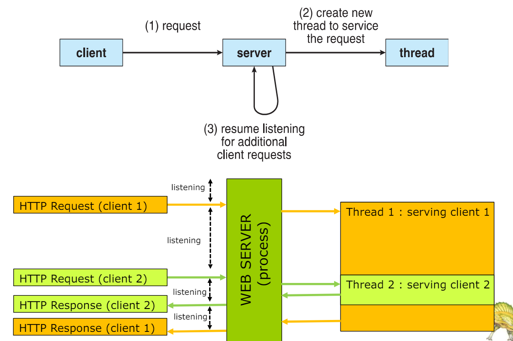
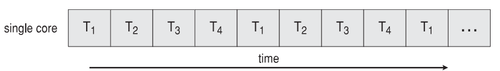
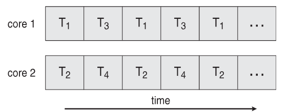
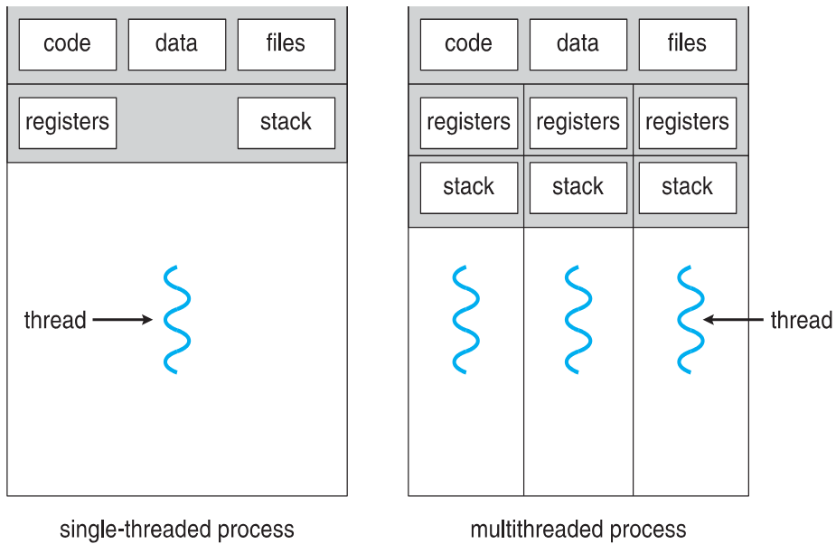
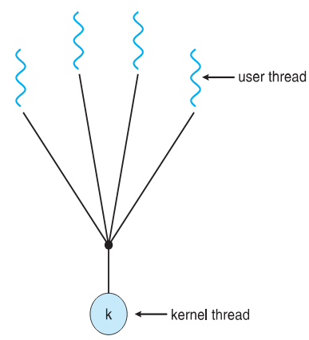
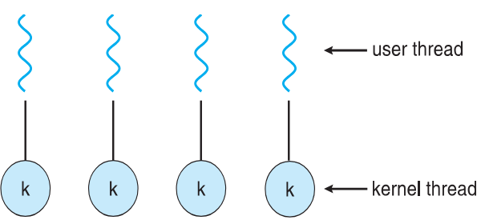
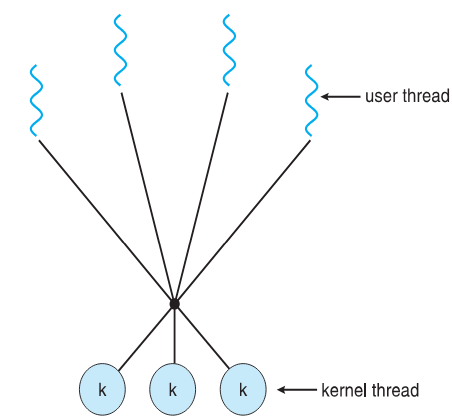
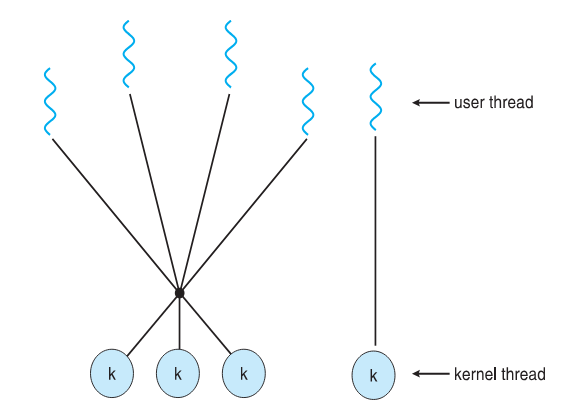

  <h1 style="text-align: center;font-weight: bold">LAPORAN PRAKTIKUM 10 SISTEM OPERASI</h1>
  <h4 style="text-align: center;">Dosen Pengampu : Dr. Ferry Astika Saputra, S.T., M.Sc.</h4>

 

  
  <h3 style="text-align: center;">Disusun Oleh : </h3>
  

    <strong>Achmad Risel Araby (3123500025)</strong> 
    <strong>Danur Isa Prabutama (3123500023)</strong> 
    <strong>Fikri Athanabil Efendi (3123500012)</strong>
  

<h3 style="text-align: center;line-height: 1.5">Politeknik Elektronika Negeri Surabaya Departemen Teknik Informatika Dan Komputer Program Studi Teknik Informatika 2023/2024</h3>
  

## Threads

Kebanyakan aplikasi modern menggunakan multithread.

Sebuah thread berjalan didalam aplikasi.

Beberapa tugas dengan aplikasi dapat diimplementasikan dengan thread terpisah. Misalnya memperbarui penampilan, mengambil data, memeriksa ejaan, dan menanggapi permintaan jaringan.

Pembuatan Thread vs. Pembuatan Proses: Thread lebih ringan, tetapi proses membutuhkan lebih banyak sumber daya.

Menyederhanakan kode dan meningkatkan efisiensi.

Kernel-kernel umumnya bersifat multithread.

### Multithreaded Server Architecture

Keuntungannya :

- Responsiveness: memungkinkan eksekusi berlanjut jika bagian dari
  proses diblokir, terutama penting untuk antarmuka pengguna.
- Resource Sharing: thread berbagi sumber daya proses, lebih mudah
  daripada memori bersama atau pengiriman pesan.
- Economy: lebih murah daripada pembuatan proses, pengalihan thread
  biaya overhead yang lebih rendah daripada pengalihan konteks.
- Scalability: proses dapat memanfaatkan multiprosesor
  arsitektur.

## Multicore Programming

Paralelisme adalah sebuah sistem dapat melakukan lebih dari satu tugas secara bersamaan. Sedangkan konkurensi adalah kemampuan program untuk menangani beberapa tugas (task) secara bersamaan.

Jenis-jenis paralelisme :

- Paralelisme data adalah sekumpulan data yang sama dibagi menjadi berbagai inti atau core, dan setiap inti melakukan operasi yang sama pada setiap subset data.
- Paralelisme tugas adalah pembagian thread atau tugas ke berbagai inti atau core, dengan masing-masing menjalankan operasi yang berbeda.

### Konkurensi vs Paralelisme

- Eksekusi konkurensi pada sistem single core :
  
- Paralelisme pada sistem multi core :
  

### Single and Multithreaded Processes

### Amdahl’s Law

Amdahl's Law adalah rumus yang digunakan untuk mencari peningkatan kecepatan maksimum yang mungkin terjadi pada suatu sistem ketika hanya sebagian dari sistem yang ditingkatkan. Berikut adalah rumusnya :

Smax = 1 / ((1-p) + p/s)

Keterangan :

- Smax adalah peningkatan maksimum teoritis dalam waktu pelaksanaan seluruh tugas. Jika Smaxnya 2, berarti tugas bisa diselesaikan dua kali lebih cepat.
- p adalah proporsi keseluruhan waktu eksekusi yang dihabiskan oleh bagian tugas yang mendapat manfaat dari pemrosesan paralel.
- 1-p adalah porsi keseluruhan waktu eksekusi yang dihabiskan oleh bagian tugas yang harus dijalankan secara berurutan.
- s adalah peningkatan kinerja, atau percepatan, bagian tugas yang mendapat manfaat dari pemrosesan paralel.

Amadahl's law sangat membantu dalam memahami kendala kinerja sistem. Anda dapat menggunakannya untuk membuat keputusan tentang metode terbaik untuk meningkatkan kinerja sistem.

### User Threads and Kernel Threads

Terdapat dua jenis utama dari pengelolaan thread :

- User threads adalah manajemen yang dilakukan oleh library thread ditingkat pengguna. Contohnya adalah Posix threads, Windows threads, Java threads.

- Kernel threads didukung hampir oleh semua sistem operasi, seperti Windows, Solaris, Linux, Tru64 Unix, Mac OS X, dan lain-lain.

## Multithreading Models

### Many to One

Model ini memiliki beberapa thread pengguna yang dipetakan ke satu thread kernel. Ketika thread pengguna membuat panggilan sistem pemblokiran seluruh blok proses. Karena hanya memiliki satu thread kernel dan hanya satu thread pengguna yang dapat mengakses kernel pada satu waktu, maka beberapa thread tidak dapat mengakses multiprosesor secara bersamaan.

### One to One

Model ini memiliki hubungan satu lawan satu antara kernel dan thread pengguna. Beberapa thread dapat berjalan pada banyak prosesor. Masalah dalam model ini adalah pembuatan thread pengguna memerlukan thread kernel yang sesuai. Karena setiap thread pengguna terhubung ke kernel yang berbeda, jika ada thread pengguna yang melakukan panggilan sistem pemblokiran, thread pengguna lainnya tidak akan diblokir.

### Many to Many

Model ini memiliki beberapa thread pengguna yang multipleks ke jumlah thread tingkat kernel yang sama atau lebih sedikit. Jumlah thread tingkat kernel khusus untuk mesin, keuntungan dari model ini adalah jika thread pengguna diblokir kita dapat menjadwalkan thread pengguna lain ke thread kernel lain. Dengan begitu, sistem tidak memblokir jika thread tertentu diblokir.

### Two-level Model

Model ini mirip dengan many to many (M:M), model ini memungkinkan thread tingkat pengguna diikat (bound) ke thread kernel tertentu. Sistem seperti IRIX, HP-UX, Tru64 UNIX, dan Solaris 8, serta versi sebelumnya, adalah contohnya.

## Thread Libraries

Threads Library adalah library yang menyediakan programmer dengan API untuk membuat dan mengelola threads.

Jenis-jenis Thread Library :

- Thread library di Ruang Pengguna (User Space): Semua perpustakaan thread beroperasi di dalam ruang pengguna sendiri, sehingga tidak memerlukan dukungan kernel sistem operasi. Semua operasi terkait thread dilakukan oleh perpustakaan itu sendiri.
- Kernel-level Library yang Didukung oleh Sistem Operasi (Kernel-level): Perpustakaan ini didukung langsung oleh kernel sistem operasi, yang berarti operasi yang terkait dengan thread dapat dilakukan dan dijalankan di dalam kernel. Ini memungkinkan Anda mengakses sumber daya sistem operasi secara instan.

### Phtreads

Perpustakaan thread tersedia sebagai perpustakaan tingkat pengguna (user-level) atau tingkat kernel. API standar POSIX (IEEE 1003.1c) untuk pembuatan thread dan
sinkronisasi.

## Implicit Threading

Implicit threading adalah penggunaan perpustakaan atau dukungan bahasa lain untuk menyembunyikan pengelolaan thread. Pembuatan dan pengelolaan utas dilakukan oleh kompiler dan run-time library, bukan oleh pemrogram.

Tiga pendekatan utama untuk manajemen thread adalah:

- Thread Pools.
- OpenMP.
- Grand Central Dispatch.

Metode lain termasuk Microsoft Threading Building Blocks
(TBB), java.util.concurrent package.

### Thread Pools

Thread pools adalah proses membuat sejumlah thread dalam sebuah kumpulan di mana mereka menunggu pekerjaan. Berikut adalah beberapa keuntungannya :

- Biasanya sedikit lebih cepat untuk melayani permintaan dengan yang sudah ada daripada membuat thread baru.
- Mengizinkan sejumlah thread didalam aplikasi untuk disesuaikan dengan ukuran pool.
- Pembagian tugas dari mekanisme pembuatan tugas yang memungkinkan perbedaan strategi dalam menjalankan tugas.

### OpenMP

OpenMP adalah sekumpulan arahan kompiler serta API untuk program yang ditulis dalam C, C++, atau FORTRAN yang menyediakan dukungan untuk pemrograman paralel di lingkungan memori bersama. Berikut adalah fitur-fitur dari openMP :

- Menyediakan dukungan untuk pemrograman paralel dalam shared-memory environments.
- Mengidentifikasi wilayah paralel sebagai blok kode yang dapat berjalan secara paralel.
- Pada saat wilayah paralel dijalankan, OpenMP secara otomatis akan membuat thread sebanyak core yang tersedia.

### Grand Central Dispatch

Grand Central Dispatch (GCD)—teknologi untuk sistem operasi Mac OS X dan iOS Apple—adalah kombinasi ekstensi bahasa C, API, dan pustaka run-time yang memungkinkan pengembang aplikasi menemukan bagian kode yang akan dijalankan. GCD memiliki ekstensi untuk bahasa C dan C++, serta API dan pustaka run-time, yang memungkinkan pengelolaan thread yang mudah dan efektif. Berikut adalah beberapa fungsi utama dari GCD :

- Memungkinkan identifikasi bagian paralel.
- Mengelola sebagian besar detail dari thread.
- GCD menggunakan blok sebagai unit kerja mandiri.

Blok ditempatkan dalam antrian pengiriman. Ditugaskan ke thread yang tersedia di thread pool ketika dihapus dari antrian. Ada dua tipe dari antriam pengiriman, yakni :

- Serial: Blok yang ditempatkan pada antrian serial akan dihapus dalam urutan FIFO. Setelah sebuah blok dikeluarkan dari antrian, maka blok tersebut harus menyelesaikan eksekusinya sebelum blok lain dihapus. Setiap proses memiliki antrian serialnya sendiri (dikenal sebagai antrian utama). Pengembang dapat membuat antrian serial tambahan yang bersifat lokal untuk proses tertentu. Antrian serial berguna untuk memastikan pelaksanaan beberapa tugas secara berurutan.
- Concurrent: Blok yang ditempatkan pada antrian bersamaan juga dihapus dalam urutan FIFO, namun beberapa blok dapat dihapus sekaligus, sehingga memungkinkan beberapa blok untuk dieksekusi secara paralel. Ada tiga antrian pengiriman serentak di seluruh sistem, dan ketiganya dibedakan berdasarkan prioritas: rendah, default, dan tinggi. Prioritas mewakili perkiraan kepentingan relatif suatu blok.

## Threading Issues

Semantik dari system calls fork() dan exec(). Fungsi Fork() memunculkan salinan proses identik yang memulai panggilan fork. Fungsi Fork() memunculkan salinan proses identik yang memulai panggilan fork.

Signal handling :

- Synchronous: program akan dikirim ke thread yang menghasilkan sinyal tersebut.
- Asynchronous: tidak dapat ditentukan ke thread mana dalam pengiriman program multithread yang harus dituju.

Pembatalan thread dapat dilakukan dengan dua cara:

- Pembatalan Asynchronous: Pembatalan asynchronous hanya melibatkan satu thread yang segera membatalkan thread target.
- Pembatalan yang Ditangguhkan: Dalam kasus pembatalan yang ditangguhkan, thread target memeriksa dirinya sendiri berulang kali hingga dapat membatalkan dirinya sendiri secara sukarela atau memutuskan sebaliknya.

### Signal Handling

Sinyal digunakan pada sistem UNIX untuk memberitahukan sebuah proses bahwa peristiwa tertentu telah terjadi.

Signal handling digunakan untuk menangani proses signal :

- Sinyal dihasilkan oleh peristiwa tertentu.
- Sinyal dikirim ke suatu proses.
- Sinyal ditangani oleh salah satu dari dua penangan sinyal, yakni default dan didefinisikan user.

Setiap sinyal memiliki penangan default yang dijalankan kernel saat menangani sinyal :

- Penangan sinyal yang ditentukan pengguna dapat menggantikan default.
- Untuk single threaded, sinyal dikirim ke proses.

Ke mana sinyal harus dikirimkan untuk multi-threaded? :

- Mengirimkan sinyal ke thread yang menjadi tujuan sinyal.
- Mengirimkan sinyal ke setiap thread dalam proses.
- Mengirimkan sinyal ke thread tertentu dalam proses.
- Menetapkan thread tertentu untuk menerima semua sinyal untuk proses.

### Thread Cancellation

Thread cancellation adalah Mengakhiri thread sebelum selesai. Thread yang akan dibatalkan adalah thread target.

Ada 2 pendekatan umum yakni :

- Pembatalan Asynchronous: menghentikan utas target dengan segera.
- Pembatalan yang ditangguhkan: memungkinkan utas target untuk memeriksa secara berkala apakah harus dibatalkan.

### Thread Local-Storage

Thread Local-Storage memungkinkan setiap thread memiliki salinan datanya sendiri. Ini berguna ketika Anda tidak memiliki kendali atas proses pembuatan thread. TLS mirip seperti data statistik yakni bersifat unik untuk setiap thread.

Perbedaannya dengan Local-Variable :

- Local-Variable hanya terlihat selama pemanggilan fungsi tunggal.
- TLS terlihat di seluruh pemanggilan fungsi.

### Scheduler Activations

Mekanisme Scheduler Activations memungkinkan sistem untuk mengoptimalkan penggunaan sumber daya sambil mempertahankan efisiensi threading pengguna dengan memberikan lapisan abstraksi antara thread kernel dan thread pengguna.

## Operating System Examples

### Windows Threads

Windows mengimplementasikan Windows API sebagai API utama untuk berbagai versi sistem operasi Windows seperti Windows 98, Windows NT, Windows 2000, Windows XP, dan Windows 7. Pada tingkat kernel, sistem ini menggunakan pemetaan satu-ke-satu. Dalam sistem ini, setiap thread memiliki beberapa komponen penting:

- Thread ID: Thread ID adalah kode unik yang diberikan kepada setiap thread.
- Register Set: Daftar Set adalah kumpulan daftar yang menunjukkan keadaan prosesor saat thread berjalan.
- User and Kernel Stacks: Stack pengguna dan kernel berbeda. Thread dalam mode pengguna menggunakan stack pengguna, dan thread dalam mode kernel menggunakan stack kernel.
- Private Data Storage Area: Area ini digunakan oleh pustaka runtime dan pustaka tautan dinamis.

Struktur data utama dari sebuah thread meliputi:

- ETHREAD (blok thread eksekutif) - termasuk penunjuk ke proses yang menjadi milik thread dan ke KTHREAD, dalam ruang kernel.
- KTHREAD (blok thread kernel) - penjadwalan dan info sinkronisasi, tumpukan mode kernel, penunjuk ke TEB, di ruang kernel.
- TEB (blok lingkungan thread) - id thread, mode-pengguna stack, penyimpanan lokal-utas, di ruang pengguna.

### Linux Threads

Di Linux, istilah yang lebih umum digunakan adalah “tugas” (task) daripada “thread”. Tugas ini dapat berupa proses utuh atau thread dalam proses tersebut.

clone() adalah panggilan sistem yang memungkinkan pembuatan tugas baru.

Saat memanggil clone(), Anda dapat mengatur bendera yang mengontrol perilaku tugas yang baru dibuat. Berikut contohnya :

<table>
<thead>
<tr>
  <th style="background-color: blue; color: white">Flag</th>
  <th style="background-color: blue; color: white">Arti</th>
<tr>
</thead>
<tbody>
  <tr>
  <td>CLONE_FS</td>
   <td>Informasi sistem berkas dibagi.</td>
  </tr>
   <tr>
   <td>CLONE_VM</td>
  <td>Ruang alamat yang sama dibagi.</td>
  </tr>
   <tr>
   <td>CLONE_SIGHAND	</td>
   <td>Penangan sinyal dibagi.</td>
  </tr>
  <tr>
  <td>CLONE_FILES</td>
  <td>Kumpulan file terbuka dibagi.</td>
  </tr>
</tbody>
</table>

struct task_struct adalah struktur data yang mewakili tugas (proses atau thread) di Linux. Ini berisi informasi tentang tugas, termasuk ID tugas, tumpukan, status, dan banyak lagi.

### SOAL

No 1 Berikan tiga contoh pemrograman di mana multithreading memberikan kinerja yang lebih baik daripada solusi single-threaded.

Jawaban:

Sebuah server Web yang melayani setiap permintaan dalam thread yang berbeda. Aplikasi yang diparalelkan seperti perkalian matriks di mana bagian-bagian yang berbeda dari matriks dapat dikerjakan secara paralel. Sebuah program GUI interaktif seperti debugger di mana sebuah thread digunakan untuk memantau masukan pengguna, thread lain mewakili aplikasi yang berjalan, dan thread ketiga memantau kinerja. Penjelasan a. Web Server:

Dalam kasus web server, masing-masing permintaan dari klien (seperti mengambil halaman web atau data dari server) dapat dianggap sebagai tugas yang independen. Dengan menggunakan multithreading, server dapat menangani beberapa permintaan secara bersamaan. Sebagai contoh, ketika satu thread sedang menunggu respon dari database, thread lainnya dapat melayani permintaan dari klien lainnya. Ini dapat mengoptimalkan penggunaan sumber daya server dan meningkatkan responsivitas secara keseluruhan.

b. Parallelized Application (Aplikasi Paralel):

Dalam kasus seperti perkalian matriks, ada banyak operasi yang dapat dijalankan secara independen. Dengan menggunakan multithreading, bagian-bagian dari matriks dapat dikalikan secara bersamaan oleh thread yang berbeda. Ini memungkinkan untuk meningkatkan throughput secara signifikan karena beberapa operasi dapat dilakukan secara paralel tanpa harus menunggu selesainya operasi sebelumnya.

c. Interactive GUI Program (Program Antarmuka Pengguna Grafis yang Interaktif):

Dalam aplikasi seperti debugger, kita mungkin memiliki tugas-tugas yang berjalan secara bersamaan. Satu thread mungkin bertanggung jawab untuk menerima input dari pengguna, yang lain untuk menjalankan aplikasi yang sedang di-debug, dan yang lainnya mungkin untuk memantau kinerja aplikasi. Dengan menggunakan multithreading, aplikasi dapat tetap responsif terhadap input pengguna sementara masih dapat menjalankan tugas-tugas lain secara bersamaan tanpa mengganggu pengalaman pengguna. Ini memungkinkan debugger untuk tetap aktif sambil melakukan pemantauan kinerja dan menjalankan kode yang sedang di-debug secara bersamaan.

References https://rdr11.it.student.pens.ac.id/Semester2/Sistem Operasi/Teori/TeoriOS7rev1_1D4TIB_2110191044.pdf

No 2 Apa dua perbedaan antara thread tingkat pengguna dan thread tingkat kernel? Dalam keadaan apa satu jenis lebih baik daripada yang lain?

Jawaban:

Thread tingkat pengguna tidak diketahui oleh kernel, sedangkan kernel mengetahui thread tingkat kernel. Pada sistem yang menggunakan pemetaan M:1 atau M:N, thread pengguna diatur oleh pustaka thread dan kernel mengatur thread kernel. Thread kernel tidak harus dikaitkan dengan proses sedangkan setiap thread pengguna milik proses. Thread kernel umumnya lebih mahal untuk dipertahankan daripada thread pengguna karena mereka harus diwakili dengan struktur data kernel. Penjelasan Perbedaan antara user-level threads dan kernel-level threads terletak pada tingkat di mana sistem operasi terlibat dan bagaimana proses penjadwalan dilakukan. User-level threads tidak dikenal oleh kernel, sementara kernel-level threads dikenal oleh kernel. Selain itu, pada sistem dengan pemetaan M:1 atau M:N, user-level threads dijadwalkan oleh perpustakaan thread, sedangkan kernel-level threads dijadwalkan oleh kernel.

Pilihan antara kedua jenis ini tergantung pada kebutuhan aplikasi. User-level threads memiliki overhead yang lebih rendah karena mereka dikelola sepenuhnya oleh program pengguna tanpa intervensi kernel. Namun, kernel-level threads dapat memberikan kinerja yang lebih baik dan lebih stabil karena mereka dapat dijadwalkan langsung oleh kernel dan memiliki kemampuan untuk menggunakan multiple core. Sebagai aturan umum, user-level threads lebih cocok untuk aplikasi yang membutuhkan manajemen yang sangat ringan, sementara kernel-level threads lebih cocok untuk aplikasi yang memerlukan kinerja dan skalabilitas yang tinggi.

References https://www.geeksforgeeks.org/difference-between-user-level-thread-and-kernel-level-thread/ https://www.geeksforgeeks.org/thread-in-operating-system/

No 3 Jelaskan tindakan yang diambil oleh kernel untuk context switch antara kernel level threads.

Jawaban:

Peralihan konteks antara benang kernel biasanya memerlukan penyimpanan nilai dari register CPU dari thread yang sedang dipindahkan dan mengembalikan register CPU dari thread baru yang sedang dijadwalkan.

Penjelasan Saat melakukan context-switch antara thread-thread di level kernel, kernel perlu menyimpan nilai-nilai register CPU dari thread yang akan diganti dan mengembalikan nilai-nilai register CPU dari thread baru yang akan dijadwalkan.

Apa itu Context Swicth Context-switch adalah proses di mana CPU beralih dari eksekusi satu proses atau thread ke proses atau thread lainnya. Saat melakukan context-switch, sistem operasi menyimpan status (atau konteks) dari proses atau thread yang sedang berjalan saat ini, termasuk nilai-nilai register CPU, pointer instruksi, dan informasi lain yang diperlukan untuk melanjutkan eksekusi nanti. Kemudian, sistem operasi memuat konteks dari proses atau thread baru yang akan dieksekusi sehingga CPU dapat melanjutkan eksekusi dari titik terakhir di mana proses atau thread sebelumnya dihentikan. Context-switch memungkinkan sistem operasi untuk memberikan kesan bahwa banyak proses atau thread sedang berjalan secara bersamaan, meskipun CPU sebenarnya melakukan eksekusi secara bergantian di antara mereka.

References https://www.geeksforgeeks.org/context-switch-in-operating-system/ No 4 Sumber daya apa saja yang digunakan ketika thread dibuat? Bagaimana perbedaannya dengan yang digunakan ketika proses dibuat?

Jawaban:

Karena thread lebih kecil daripada proses, pembuatan thread biasanya menggunakan sumber daya yang lebih sedikit dibandingkan dengan pembuatan proses. Membuat proses membutuhkan alokasi blok kontrol proses (PCB), struktur data yang cukup besar. PCB mencakup peta memori, daftar file yang dibuka, dan variabel lingkungan. Mengalokasikan dan mengelola peta memori biasanya merupakan aktivitas yang paling memakan waktu. Membuat thread pengguna atau kernel melibatkan alokasi struktur data kecil untuk menampung set register, tumpukan, dan prioritas.

Penjelasan Ketika membuat sebuah thread, digunakan lebih sedikit sumber daya dibandingkan dengan membuat sebuah proses. Proses memerlukan alokasi blok kontrol proses (PCB), struktur data yang cukup besar, yang mencakup peta memori, daftar file terbuka, dan variabel lingkungan. Pembuatan PCB dan pengelolaan peta memori biasanya memakan waktu paling lama. Sedangkan, pembuatan sebuah thread melibatkan alokasi struktur data kecil untuk menampung set register, tumpukan, dan prioritas.

References https://www.guru99.com/difference-between-process-and-thread.html?gpp&gpp_sid No 5 Asumsikan bahwa sistem operasi memetakan thread tingkat pengguna ke kernel menggunakan model many-to-many dan bahwa pemetaan dilakukan melalui LWPs. Selain itu, sistem memungkinkan pengembang untuk membuat thread real-time untuk digunakan dalam sistem real-time. Apakah perlu mengikat thread real-time ke LWP? Jelaskan.

Jawaban:

Ya. Waktu sangat krusial untuk aplikasi real-time. Jika thread ditandai sebagai real-time tetapi tidak terikat ke LWP, thread mungkin harus menunggu untuk dihubungkan ke LWP sebelum berjalan. Pertimbangkan jika thread real-time sedang berjalan (terhubung ke LWP) dan kemudian melanjutkan untuk memblokir (mis. harus melakukan I/O, telah dipraemptif oleh thread real-time prioritas lebih tinggi, sedang menunggu kunci penguncian mutual, dll.) Sementara thread real-time diblokir, LWP yang sebelumnya terhubung telah ditugaskan ke thread lain. Ketika thread real-time telah dijadwalkan untuk berjalan lagi, ia harus menunggu untuk dihubungkan ke LWP. Dengan mengikat LWP ke thread real-time, Anda memastikan thread akan dapat berjalan dengan penundaan minimal setelah dijadwalkan.

Penjelasan Tentu! Saat menggunakan thread real-time dalam sistem, penting untuk mengikatnya ke dalam unit pemrosesan yang disebut LWP. Tanpa ikatan ini, thread real-time mungkin harus menunggu sebelum bisa berjalan. Ini bisa menyebabkan penundaan yang tidak diinginkan dalam kinerja aplikasi yang membutuhkan waktu respons cepat. Dengan mengikat thread real-time ke LWP, kita memastikan bahwa thread tersebut bisa langsung berjalan begitu dijadwalkan tanpa penundaan tambahan.

Apa itu LWP? LWP singkatan dari "Lightweight Process" atau Proses Ringan. Ini adalah unit pemrosesan kecil yang dikelola oleh sistem operasi untuk mengeksekusi thread. Dalam sistem operasi yang menggunakan model many-to-many untuk memetakan thread pengguna ke kernel, seperti Solaris dan beberapa versi UNIX lainnya, LWP berfungsi sebagai perantara antara thread pengguna dan kernel. Mereka membantu dalam penjadwalan dan pengelolaan sumber daya untuk thread, memungkinkan sistem operasi untuk mengelola thread secara efisien. Dalam konteks ini, mengikat thread real-time ke LWP berarti menghubungkan thread tersebut ke unit pemrosesan yang akan mengeksekusinya.

### Referensi

- https://www.geeksforgeeks.org/thread-in-operating-system/
- https://www.geeksforgeeks.org/difference-between-concurrency-and-parallelism/
- https://www.geeksforgeeks.org/challanges-in-programming-for-multicore-system/
- https://www.geeksforgeeks.org/computer-organization-amdahls-law-and-its-proof/
- https://www.geeksforgeeks.org/difference-between-user-level-thread-and-kernel-level-thread/
- https://www.geeksforgeeks.org/multi-threading-models-in-process-management/
- https://www.geeksforgeeks.org/multi-threading-models-in-process-management/
- https://www.geeksforgeeks.org/posix-threads-in-os/
- https://www.tutorialspoint.com/implicit-threading-and-language-based-threads
- https://www.geeksforgeeks.org/threading-issues/
