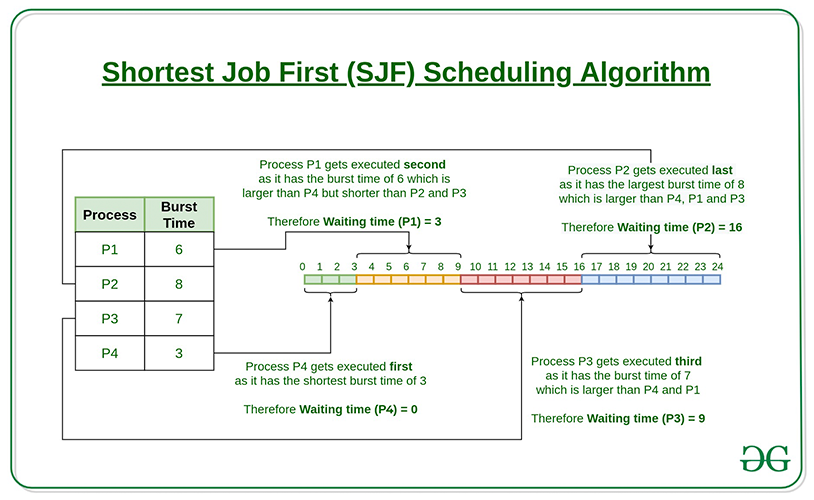

  <h1 style="text-align: center;font-weight: bold">LAPORAN PRAKTIKUM 11 SISTEM OPERASI</h1>
  <h4 style="text-align: center;">Dosen Pengampu : Dr. Ferry Astika Saputra, S.T., M.Sc.</h4>

 

  
  <h3 style="text-align: center;">Disusun Oleh : </h3>
  

    <strong>Achmad Risel Araby (3123500025)</strong> 
    <strong>Danur Isa Prabutama (3123500023)</strong> 
    <strong>Fikri Athanabil Efendi (3123500012)</strong>
  

<h3 style="text-align: center;line-height: 1.5">Politeknik Elektronika Negeri Surabaya Departemen Teknik Informatika Dan Komputer Program Studi Teknik Informatika 2023/2024</h3>
  

## SHEDULLING ALGORITHM

### First-Come First-Serve Algorithm

Perhitungan Secara Teori :

Hasil Percobaan Running Program :

Flowchart :

Analisa :
Algoritma FCFS adalah metode penjadwalan yang sederhana dan mudah diterapkan, namun memiliki beberapa kekurangan yang dalam waktu tunggu dan efisiensi, terutama dalam sistem yang memerlukan respons cepat. FCFS paling efektif digunakan dalam lingkungan batch processing atau sistem non-interaktif di mana semua proses memiliki waktu eksekusi yang serupa. Meskipun adil dalam urutan eksekusi, kelemahannya dalam menangani proses dengan waktu eksekusi yang bervariasi membuatnya kurang ideal untuk banyak aplikasi modern yang memerlukan penjadwalan yang lebih dinamis dan responsif.

### Shortest Job First Algorithm

Perhitungan Secara Teori :

Hasil Percobaan Running Program :

Flowchart :

Analisa :
Algoritma Shortest Job First adalah algoritma penjadwalan yang sederhana namun efektif untuk meminimalkan waktu tunggu rata-rata dan meningkatkan throughput sistem. Kelebihan utamanya terletak pada kemampuan untuk menyelesaikan proses dengan cepat, tetapi kekurangannya, seperti kemungkinan kelaparan proses dan kesulitan dalam memperkirakan waktu eksekusi, membatasi penerapannya. Algoritma ini paling cocok digunakan dalam lingkungan di mana semua proses dan waktu eksekusi mereka diketahui sebelumnya dan tidak ada proses baru yang datang secara dinamis. Namun, dalam konteks tertentu, seperti batch processing atau pemrosesan data dengan waktu eksekusi yang diketahui, SJF bisa menjadi pilihan yang sangat efektif.

### Round Robin Algorithm

Perhitungan Secara Teori :

Hasil Percobaan Running Program :

Flowchart :

Analisa :
Algoritma Round Robin adalah metode penjadwalan CPU sederhana dan adil yang memberikan setiap proses waktu eksekusi yang sama. Meskipun dapat menyebabkan overhead switching yang tinggi dan waktu tunggu yang meningkat dalam kondisi tertentu, kelebihan dari keadilan dan responsivitas membuatnya sangat berguna dalam sistem time-sharing dan aplikasi interaktif. Oleh karena itu, pemilihan quantum time yang tepat sangat penting untuk mencapai keseimbangan antara overhead switching dan performa sistem yang optimal.
