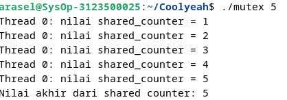

  <h1 style="text-align: center;font-weight: bold">LAPORAN PRAKTIKUM 12 SISTEM OPERASI</h1>
  <h4 style="text-align: center;">Dosen Pengampu : Dr. Ferry Astika Saputra, S.T., M.Sc.</h4>

 

  
  <h3 style="text-align: center;">Disusun Oleh : </h3>
  

    <strong>Achmad Risel Araby (3123500025)</strong> 
    <strong>Danur Isa Prabutama (3123500023)</strong> 
    <strong>Fikri Athanabil Efendi (3123500012)</strong>
  

<h3 style="text-align: center;line-height: 1.5">Politeknik Elektronika Negeri Surabaya Departemen Teknik Informatika Dan Komputer Program Studi Teknik Informatika 2023/2024</h3>
  

## TUGAS MUTEX

### Program Tanpa Mutex

Output :

Analisa :

Program diatas merupakan program untuk membuat sejumlah thread yang menjalankan fungsi `thread_function` untuk menambah variabel global `shared_counter`. Pada fungsi `main`, jumlah thread diambil dari argumen program, kemudian memori dialokasikan untuk menyimpan ID thread. Setiap thread dibuat menggunakan `pthread_create` dan dieksekusi untuk menambah `shared_counter`. Setelah semua thread selesai, memori yang dialokasikan dibebaskan dan nilai akhir dari `shared_counter` ditampilkan. Namun, kode ini rentan terhadap `race condition` karena beberapa thread mengakses dan memodifikasi `shared_counter` secara bersamaan tanpa sinkronisasi, yang dapat menyebabkan hasil yang tidak konsisten. Untuk mengatasi kondisi balapan, mutex dapat digunakan untuk memastikan bahwa hanya satu thread yang dapat mengakses `shared_counter` pada satu waktu.

### Program Dengan Mutex

Output :

Analisa :

Program diatas merupakan program untuk membuat sejumlah thread yang menjalankan fungsi `thread_function`, di mana setiap thread menambah variabel global `shared_counter` dengan aman menggunakan mutex untuk mencegah kondisi balapan. Fungsi `main` memeriksa argumen untuk menentukan jumlah thread, mengalokasikan memori untuk menyimpan ID thread, dan membuat thread-thread tersebut dengan `pthread_create`. Setiap thread mengunci mutex sebelum menambah `shared_counter` dan membukanya kembali setelah selesai, untuk memastikan hanya satu thread yang dapat mengakses dan memodifikasi `shared_counter` pada satu waktu. Setelah semua thread selesai dieksekusi, memori yang dialokasikan dibebaskan dan nilai akhir dari `shared_counter` ditampilkan. Penggunaan mutex memastikan konsistensi dan keamanan data dalam lingkungan multi-threading.
