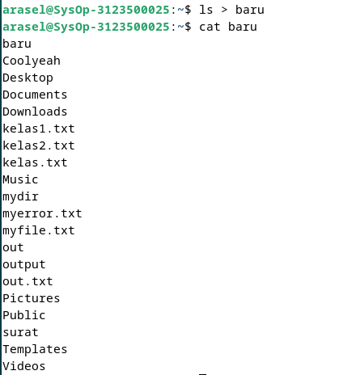

<div align="center">
  <h2 style="text-align: center;font-weight: bold">LAPORAN PRAKTIKUM 4 SISTEM OPERASI</br></h2>
  <h4 style="text-align: center;">Dosen Pengampu : Dr. Ferry Astika Saputra, S.T., M.Sc.</h4>
</div>
<br />
<div align="center">
  
  <h3 style="text-align: center;">Disusun Oleh : <br>Kelompok 7</h3>
  <p style="text-align: center;">
    <strong>Achmad Risel Araby (3123500025)</strong><br>
    <strong>Danur Isa Prabutama (3123500023)</strong><br>
    <strong>Fikri Athanabil Efendi (3123500012)</strong>

  </p>

<h3 style="text-align: center;line-height: 1.5">Politeknik Elektronika Negeri Surabaya<br>Departemen Teknik Informatika Dan Komputer<br>Program Studi Teknik Informatika<br>2024/2025</h3>
  <hr><hr>
</div>

# Operasi Input Output

Referensi : [Shell Programming](https://www.geeksforgeeks.org/introduction-linux-shell-shell-scripting/?ref=shm_)

## POKOK BAHASAN:

```
* Pipeline
* Redirection
```

## TUJUAN PEMBELAJARAN:

Setelah mempelajari materi dalam bab ini, mahasiswa diharapkan mampu:

- Memahami konsep proses I/O dan redirection
- Memahami standar input, output dan error
- Menggunakan notasi output, append dan here document
- Memahami konsep _PIPE_ dan filter

## DASAR TEORI:

### 1. PROSES I/O

Sebuah proses memerlukan Input dan Output. Instruksi (command) yang diberikan pada Linux melalui Shell disebut sebagai eksekusi program yang selanjutnya disebut proses. Setiap kali instruksi diberikan, maka Linux kernel akan menciptakan sebuah proses dengan memberikan nomor PID (Process Identity). Proses dalam Linux selalu membutuhkan Input dan menghasilkan suatu Output.


Dalam konteks Linux input/output adalah :

- Keyboard (input)
- Layar (output)
- Files
- Struktur data kernel
- Peralatan I/O lainnya (misalnya Network)

## 2. FILE DESCRIPTOR

Linux berkomunikasi dengan file melalui file descriptor yang direpresentasikan melalui angka yang dimulai dari 0, 1, 2 dan seterusnya. Tiga buah file descriptor standar yang lalu diciptakan oleh proses adalah :

- 0 = keyboard (standar input)
- 1 = layar (standar output)
- 2 = layar (standar error)

Linux tidak membedakan antara peralatan hardware dan file. Linux memanipulasi peralatan hardware dengan memperlakukannya sama dengan ketika memperlakukan sebuah file.

## 3.PEMBELOKAN (REDIRECTION)

Pembelokan dilakukan untuk standard input, output dan error, yaitu untuk mengalihkan file descriptor dari 0, 1 dan 2. Simbol untuk pembelokan adalah :


## 4. PIPA (PIPELINE)

Mekanisme pipa digunakan sebagai alat komunikasi antar proses.


Proses-1 menghasilkan output yang selanjutnya digunakan sebagai input oleh Proses-2. Hubungan output input ini dinamakan `pipa ataiupipelining`, yang menghubungkan Proses-1 dengan Proses-2 dan dinyatakan dengan symbol “|”.

```
    Proses1 | Proses
```

## 5. FILTER

Filter adalah utilitas Linux yang dapat memproses standard input (dari keyboard) dan menampilkan hasilnya pada standard output (layar). Contoh filter adalah cat, sort, grep, pr, head, tail, paste dan lainnya.
Pada sebuah rangkaian pipa :

        P<sub>1</sub> | P<sub>2</sub> | P<sub>3</sub> ... | P<sub>n-1</sub> | P<sub>n</sub>

Maka P2 sampai dengan P<sub>n-1</sub> berfungsi sebagai filter. P1 (awal) dan Pn (terakhir) boleh tidak filter. Utilitas yang bukan filter misalnya who, ls, ps, lp, lpr, mail dan lainnya.
Beberapa perintah Linux yang digunakan untuk proses penyaringan antara lain :

- Perintah `grep`
  Digunakan untuk menyaring masukannya dan menampilkan baris-baris yang hanya mengandung pola yang ditentukan. Pola ini disebut regular expression.
- Perintah `wc`
  Digunakan untuk menghitung jumlah baris, kata dan karakter dari baris-baris masukan yang diberikan kepadanya. Untuk mengetahui berapa baris gunakan option –l, untuk mengetahui berapa kata, gunakan option –w dan untuk mengetahui berapa karakter, gunakan option –c.
  Jika salah satu option tidak digunakan, maka tampilannya adalah jumlah baris, jumlah kata dan jumlah karakter.
- Perintah `sort`
  Digunakan untuk mengurutkan masukannya berdasarkan urutan nomor ASCII dari karakter.
- Perintah `cut`
  Digunakan untuk mengambil kolom tertentu dari baris-baris masukannya, yang ditentukan pada option –c.
- Perintah `uniq`
  Digunakan untuk menghilangkan baris-baris berurutan yang mengalami duplikasi, biasanya digabungkan dalam pipeline dengan `sort`.

## TUGAS PENDAHULUAN:

## Jawablah pertanyaan-pertanyaan di bawah ini :

1. Apa yang dimaksud redirection?
2. Apa yang dimaksud pipeline?
3. Apa yang dimaksud perintah di bawah ini :
   echo, cat, more, sort, grep, wc, cut, uniq

## PERCOBAAN:

1. Login sebagai user.
2. Bukalah Console Terminal dan lakukan percobaan-percobaan di bawah ini. Perhatikan hasil setiap percobaan.
3. Selesaikan soal-soal latihan.

## Percobaan 1 : File descriptor

1. Output ke layar (standar output), input dari system (kernel)

   ```
   $ ps
   ```

   Output :

   

   Analisis :

   PS digunakan untuk melihat daftar proses yang sedang berjalan di sistem.

2. Output ke layar (standar output), input dari keyboard (standard input)

   ```
    $ cat
    hallo, apa khabar
    hallo, apa khabar
    exit dengan ^d
    exit dengan ^d
    [Ctrl-d]
   ```

   Output :

   

   Analisis :

   Cat digunakan untuk menampilkan isi suatu file.

3. Input nama direktori, output tidak ada (membuat direktori baru), bila terjadi error maka tampilan error pada layar (standard error)

   ```
   $ mkdir mydir
   $ mkdir mydir **(Terdapat pesan error)**
   ```

   Output :

   

   Analisis :

   Mkdir digunakan untuk membuat folder direktori baru.

## Percobaan 2 : Pembelokan (redirection)

1. Pembelokan standar output

   ```
    $ cat 1> myfile.txt
    Ini adalah teks yang saya simpan ke file myfile.txt
   ```

   Output :

   

   Analisis :

   Digunakan untuk menyimpan teks kedalam suatu file.

2. Pembelokan standar input, yaitu input dibelokkan dari keyboard menjadi dari file

   ```
    $ cat 0< myfile.txt
    $ cat myfile.txt
   ```

   Output :

   

   Analisis :

   Digunakan untuk menyimpan teks kedalam suatu file.

3. Pembelokan standar error untuk disimpan di file

   ```
    $ mkdir mydir (Terdapat pesan error)
    $ mkdir mydir 2> myerror.txt
    $ cat myerror.txt
   ```

   Output :

   

   Analisis :

   Mkdir digunakan untuk membuat direktori folder baru, sedangkan 2> digunakan untuk mengarahkan pesan error ke file yang dituju dan tidak ditampilkan dilayar, dan Cat digunakan untuk menampilkan isi suatu file.

4. Notasi 2>&1 : pembelokan standar error (2>) adalah identik dengan file descriptor 1.

   ```
    $ ls filebaru (Terdapat pesan error)
    $ ls filebaru 2> out.txt
    $ cat out.txt
    $ ls filebaru 2> out.txt 2>&
    $ cat out.txt
   ```

   Output :

   

   Analisis :

   ls digunakan untuk menampilkan daftar isi direktori, 2> mengarahkan pesan error ke file yang dituju dan tidak ditampilkan dilayar, 2>&1 digunakan untuk menyimpan error sekaligus menampilkannya ke layar.

5. Notasi 1>&2 (atau >&2) : pembelokan standar output adalah sama dengan file descriptor 2 yaitu standar error

   ```
   $ echo “mencoba menulis file” 1> baru
   $ cat filebaru 2> baru 1>&
   $ cat baru
   ```

   Output :
   

   Analisis :

   Menggunakan echo mencetak pesan ke terminal, lalu menggunakan 1> untuk membelokkan output file baru. 2> digunakan untuk membelokkan output error (stderr) ke file baru dan 1>&2 digunakan untuk menggabungkan standar output (stdout) dan output error (stderr). Dan cat digunakan untuk mencetak pesan suatu file ke layar.

6. Notasi >> (append)

   ```
   $ echo “kata pertama” > surat
   $ echo “kata kedua” >> surat
   $ echo “kata ketiga” >> surat
   $ cat surat
   $ echo “kata keempat” > surat
   $ cat surat
   ```

   Output :

   

   Analisis :

   > adalah operator redirect yang digunakan untuk mengarahkan output dari suatu perintah ke file, sedangkan >> digunakan untuk mengarahkan output dari suatu peruntah ke file dan ditempatkan diakhir file.

7. Notasi here document (<<++ .... ++) digunakan sebagai pembatas input dari keyboard. Perhatikan bahwa tanda pembatas dapat digantikan dengan tanda apa saja, namun harus sama dan tanda penutup harus diberikan pada awal baris

   ```
   $ cat <<++
   Hallo, apa kabar?
   Baik-baik saja?
   Ok!
   ++
   $ cat <<%%%
   Hallo, apa kabar?
   Baik-baik saja?
   Ok!
   %%%
   ```

   Output :

   

   Analisis :

   <<++ dan <<%%% kurang lebih memiliki kegunaan yang sama digunakan untuk memasukkan teks langsung didalam terminal, dan mengakhirinya tergantung apa yang kalian gunakan, jika <<++ maka diakhiri dengan ++ dan <<%%% maka diakhiri dengan %%%.

8. Notasi – (input keyboard) adalah representan input dari keyboard. Artinya menampilkan file 1, kemudian menampilkan input dari keyboard dan menampilkan file 2. Perhatikan bahwa notasi “-“ berarti menyelipkan input dari keyboard

```
$ cat myfile.txt – surat
```

Output :


Analisis :

cat myfile.txt - surat, artinya menampilkan isi file myfile.txt dan dilanjutkan menampilkan isi file surat.

## Percobaan 3 : Pipa (pipeline)

1. Operator pipa (|) digunakan untuk membuat eksekusi proses dengan melewati data langsung ke data lainnya.

   ```
   $ who
   $ who | sort
   $ who | sort –r
   $ who > tmp
   $ sort tmp
   $ rm tmp
   $ ls –l /etc | more
   $ ls –l /etc | sort | more
   ```

   Output :
   
   
   

   Analisis :

   Who digunakan untuk menampilkan informasi pengguna yang sedang login ke sistem, who | sort sama saja namun diurutkan berdasarkan abjad, sedangkan who | sort –r diurutkan berdasarkan abjad yang terbalik (z-a), who > tmp digunakan untuk mengalihkan output dari perintah who ke dalam file tmp, sort tmp digunakan untuk mengurutkan isi dari file tmp, rm tmp digunakan untuk menghapus file tmp, ls –l /etc | more digunakan untuk menampilkan daftar detail file dan direktori di /etc, ls –l /etc | sort | more sama saja namun diurutkan sesuai abjad.

2. Untuk membelokkan standart output ke file, digunakan operator ">"

   ```
   $ echo hello
   $ echo hello > output
   $ cat output
   ```

   Output :
   

   Analisis :
   echo digunakan untuk menulis pesan diterminal, dan > digunakan untuk membelokkan pesan tersebut kedalam suatu file, dicetak kedalam layar menggunakan cat.

3. Untuk menambahkan output ke file digunakan operator ">>"

   ```
   $ echo bye >> output
   $ cat output
   ```

   Output :
   

   Analisis :
   echo digunakan untuk menulis pesan diterminal, >> digunakan untuk menambahkan pesan kedalam posisi akhir file, dan cat untuk mencetak isi file kedalam layar.

4. Untuk membelokkan standart input digunakan operator "<"

   ```
   $ cat < output
   ```

   Output :
   

   Analisis :
   cat digunakan untuk mencetak isi file kedalam layar sedangkan < digunakan untuk mengalihkan input ke suatu file.

5. Pembelokan standart input dan standart output dapat dikombinasikan tetapi tidak boleh menggunakan nama file yang sama sebagai standart input dan output.

   ```
   $ cat < output > out
   $ cat out
   $ cat < output >> out
   $ cat out
   $ cat < output > output
   $ cat output
   $ cat < out >> out (Proses tidak berhenti)
   [Ctrl-c]
   $ cat out
   ```

   Output :

   

   Analisis :
   cat digunakan untuk mencetak isi file kedalam layar sedangkan < digunakan untuk mengalihkan input ke suatu file, > digunakan untuk menambahkan pesan tersebut kedalam suatu file, >> digunakan untuk menambahkan pesan kedalam posisi akhir file.

## Percobaan 4 : Filter

1. Pipa juga digunakan untuk mengkombinasikan utilitas sistem untuk membentuk fungsi yang lebih kompleks

   ```
    $ w –h | grep <user>
    $ grep <user> /etc/passwd
    $ ls /etc | wc
    $ ls /etc | wc –l
    $ cat > kelas1.txt
    Badu
    Zulkifli
    Yulizir
    Yudi
    Ade
    [Ctrl-d]
    $ cat > kelas2.txt
    Budi
    Gama
    Asep
    Muchlis
    [Ctrl-d]
    $ cat kelas1.txt kelas2.txt | sort
    $ cat kelas1.txt kelas2.txt > kelas.txt
    $ cat kelas.txt | sort | uniq
   ```

   Output :
   
   

   Analisis :
   w digunakan untuk menampilkan informasi tentang pengguna yang sedang login ke sistem, -h adalah flag untuk w yang memerintahkannya untuk menampilkan baris header berisi informasi tentang nama sistem, uptime (waktu sistem aktif), jumlah pengguna, rata-rata penggunaan CPU, dan proses yang sedang berjalan, grep digunakan untuk mencari tergantung apa yang ingin digunakan, wc digunakan untuk menghitung baris, kata, dan karakter dalam file, > digunakan untuk menambahkan suatu pesan kedalam suatu file, sort digunakan untuk mengurutkan isi suatu file berdasarkan abjad, dan uniq digunakan untuk menampilkan baris yang unik dari input.

## LATIHAN:

1. Lihat daftar secara lengkap pada direktori aktif, belokkan tampilan standard output ke file baru.

   Output :
   

   Analisis :
   ls digunakan untuk melihat seluruh isi dari suatu direktori, > digunakan untuk menambahkan suatu isi kedalam suatu file, dan cat digunakan untuk mencetak isi file kedalam layar.

2. Lihat daftar secara lengkap pada direktori /etc/passwd, belokkan tampilan standard output ke file baru tanpa menghapus file baru sebelumnya.

   Output :
   

   Analisis :

   ls digunakan untuk melihat seluruh isi dari suatu direktori, >> digunakan untuk menambahkan isi kedalam posisi akhir file, cat digunakan untuk mencetak isi file kedalam layar.

3. Urutkan file baru dengan cara membelokkan standard input.

   Output :

   

   Analisis :

   Melakukan sort terhadap isi baru, sort digunakan untuk mengurutkan isi suatu file berdasarkan abjad.

4. Urutkan file baru dengan cara membelokkan standard input dan standard output ke file baru.urut.

   Output :

   

   Analisis :

   Menggunakan < untuk membelokkan input baru lalu manmbahkan isinya menggunakan > ke dalam baru.urut.

5. Buatlah direktori latihan 2 sebanyak 2 kali dan belokkan standard error ke file rmdirerror.txt.

   Output :

   

   Analisis :

   Membuat 2 direktori latihan 2 dengan mkdir, lalu dibelokkan standar error ke rmdirerror.txt dengan 2> lalu ditampilkan ke layar dengan cat.

6. Urutkan kalimat berikut :

   ```
   Jakarta
   Bandung
   Surabaya
   Padang
   Palembang
   Lampung
   ```

   Dengan menggunakan notasi **here document (<@@@ ...@@@)** . [HINT](https://www.geeksforgeeks.org/how-to-use-here-document-in-bash-programming/)

   Output :
   

   Analisis :

   Menggunakan cat dan <<@ 1> untuk membuat file dan memberi isi serta mencetaknya langsung di layar, kemudian menggunakan sort untuk mengurutkannya berdasarkan abjad.

7. Hitung jumlah baris, kata dan karakter dari file baru.urut dengan menggunakan filter dan tambahkan data tersebut ke file baru.

   Output :

   

   Analisis :

   Menggunakan cat, <, dan wc untuk menghitung jumlah baris, kata, dan karakter, lalu ditambahkan ke baru dengan >> dan mencetaknya di layar.

8. Gunakan perintah di bawah ini dan perhatikan hasilnya.

   ```
    $ cat > hello.txt
    dog cat
    cat duck
    dog chicken
    chicken duck
    chicken cat
    dog duck
    [Ctrl-d]
    $ cat hello.txt | sort | uniq
    $ cat hello.txt | grep “dog” | grep –v “cat”
   ```

   Output :
   

   Analisis :
   menggunakan cat dan > untuk mengisi file.txt, lalu menggunakan sort dan uniq untuk mengurutkan baris, dan menggunakan grep untuk melakukan filter.

## KESIMPULAN

Dari praktikum telah membuka wawasan kita tentang berbagai perintah yang tersedia di Linux. Kita mencoba beberapa perintah dan menganalisis outputnya. Hal ini membantu kita memahami cara kerja sistem operasi Linux dengan lebih baik.

## LAPORAN RESMI:

1. Analisa hasil percobaan 1 sampai dengan 4, untuk setiap perintah jelaskan tampilannya.
2. Kerjakan latihan diatas dan analisa hasilnya
3. Berikan kesimpulan dari praktikum ini.
