

  <h2 style="text-align: center;font-weight: bold">LAPORAN PRAKTIKUM 3 SISTEM OPERASI </h2>
  <h4 style="text-align: center;">Dosen Pengampu : Dr. Ferry Astika Saputra, S.T., M.Sc.</h4>

 

  
  <h3 style="text-align: center;">Disusun Oleh :  Kelompok 7</h3>
  

    <strong>Achmad Risel Araby (3123500025)</strong> 
    <strong>Danur Isa Prabutama (3123500023)</strong> 
    <strong>Fikri Athanabil Efendi (3123500012)</strong>

  

<h3 style="text-align: center;line-height: 1.5">Politeknik Elektronika Negeri Surabaya Departemen Teknik Informatika Dan Komputer Program Studi Teknik Informatika 2024/2025</h3>
  

**Praktikum 4 A**

**Proses dan Manajemen Proses**

**POKOK BAHASAN:**

- Proses pada Sistem Operasi Linux
- Manajemen Proses pada Sistem Operasi Linux

**TUJUAN BELAJAR:**

Setelah mempelajari materi dalam bab ini, mahasiswa diharapkan mampu:

- Memahami konsep proses pada sistem operasi Linux.
- Menampilkan beberapa cara menampilkan hubungan proses parent dan child.
- Menampilkan status proses dengan beberapa format berbeda.
- Melakukan pengontrolan proses pada shell.
- Memahami penjadwalan prioritas.

**DASAR TEORI:**

**1 KONSEP PROSES PADA SISTEM OPERASI LINUX**

Proses adalah program yang sedang dieksekusi. Setiap kali menggunakan utilitas sistem atau program aplikasi dari shell, satu atau lebih proses ”child” akan dibuat oleh shell sesuai perintah yang diberikan. Setiap kali instruksi diberikan pada Linux shell, maka kernel akan menciptakan sebuah proses-id. Proses ini disebut juga dengan terminology Unix sebagai sebuah Job. Proses Id (PID) dimulai dari 0, yaitu proses INIT, kemudian diikuti oleh proses berikutnya (terdaftar pada /etc/inittab).

Beberapa tipe proses :

- **Foreground**

  Proses yang diciptakan oleh pemakai langsung pada terminal (interaktif, dialog)

31

**PRAKTIKUM 4 PROSES DAN MANAJEMEN PROSES** 38

- **Batch**

  Proses yang dikumpulkan dan dijalankan secara sekuensial (satu persatu). Prose Batch tidak diasosiasikan (berinteraksi) dengan terminal.

- **Daemon**

  Proses yang menunggu permintaan (request) dari proses lainnya dan menjalankan tugas sesuai dengan permintaan tersebut. Bila tidak ada request, maka program ini akan berada dalam kondisi “idle” dan tidak menggunakan waktu hitung CPU.

  Umumnya nama proses daemon di UNIX berakhiran d, misalnya inetd, named, popd dll

**2 SINYAL**

Proses dapat mengirim dan menerima sinyal dari dan ke proses lainnya. Proses mengirim sinyal melalui instruksi “kill” dengan format

kill [-nomor sinyal] PID

Nomor sinyal : 1 s/d maksimum nomor sinyal yang didefinisikan system

Standar nomor sinyal yang terpenting adalah :

| **No Sinyal** | **Nama** | **Deskripsi**                                                                         |
| ------------- | -------- | ------------------------------------------------------------------------------------- |
| 1             | SIGHUP   | Hangup, sinyal dikirim bila proses terputus, misalnya melalui putusnya hubungan modem |
| 2             | SIGINT   | Sinyal interrupt, melalui ^C                                                          |
| 3             | SIGQUIT  | Sinyal Quit, melalui ^\                                                               |
| 9             | SIGKILL  | Sinyal Kill, menghentikan proses                                                      |
| 15            | SIGTERM  | Sinyal terminasi software                                                             |

**3 MENGIRIM SINYAL**

Mengirim sinyal adalah satu alat komunikasi antar proses, yaitu memberitahukan proses yang sedang berjalan bahwa ada sesuatu yang harus dikendalikan. Berdasarkan sinyal yang dikirim ini maka proses dapat bereaksi dan

administrator/programmer dapat menentukan reaksi tersebut. Mengirim sinyal menggunakan instruksi

kill [-nomor sinyal] PID

Sebelum mengirim sinyal PID proses yang akan dikirim harus diketahui

terlebih dahulu.

**4 MENGONTROL PROSES PADA SHELL**

Shell menyediakan fasilitas job control yang memungkinkan mengontrol beberapa job atau proses yang sedang berjalan pada waktu yang sama. Misalnya bila melakukan pengeditan file teks dan ingin melakukan interrupt pengeditan untuk mengerjakan hal lainnya. Bila selesai, dapat kembali (_switch_) ke editor dan melakukan pengeditan file teks kembali.

Job bekerja pada **foreground** atau **background**. Pada _foreground_ hanya diperuntukkan untuk satu job pada satu waktu. Job pada _foreground_ akan mengontrol shell - menerima input dari keyboard dan mengirim output ke layar. Job pada background tidak menerima input dari terminal, biasanya berjalan tanpa memerlukan interaksi.

Job pada _foreground_ kemungkinan dihentikan sementara (suspend), dengan menekan [Ctrl-Z]. Job yang dihentikan sementara dapat dijalankan kembali pada _foreground_ atau _background_ sesuai keperluan dengan menekan ”**fg**” atau ”**bg**”. Sebagai catatan, menghentikan job sementara sangat berbeda dengan melakuakan interrupt job (biasanya menggunakan [Ctrl-C]), dimana job yang diinterrup akan dimatikan secara permanen dan tidak dapat dijalankan lagi.

**5 MENGONTROL PROSES LAIN**

Perintah ps dapat digunakan untuk menunjukkan semua proses yang sedang berjalan pada mesin (bukan hanya proses pada shell saat ini) dengan format :

ps –fae atau

ps -aux

Beberapa versi UNIX mempunyai utilitas sistem yang disebut top yang menyediakan cara interaktif untuk memonitor aktifitas sistem. Statistik secara detail

dengan proses yang berjalan ditampilkan dan secara terus-menerus di-_refresh_. Proses ditampilkan secara terurut dari utilitas CPU. Kunci yang berguna pada\* top adalah

s – set update frequency

u – display proses dari satu user

k – kill proses (dengan PID)

q – quit

Utilitas untuk melakukan pengontrolan proses dapat ditemukan pada sistem UNIX adalah perintah killall. Perintah ini akan menghentikan proses sesuai PID atau job number proses.

**TUGAS PENDAHULUAN:**

Jawablah pertanyaan-pertanyaan di bawah ini :

1. Apa yang dimaksud dengan proses ?

Jawab :

Proses adalah program yang sedang dieksekusi. Setiap kali menggunakan utilitas sistem atau program aplikasi dari shell, satu atau lebih proses ”child” akan dibuat oleh shell sesuai perintah yang diberikan. Setiap kali instruksi dibe rikan pada Linux shell, maka kernel akan menciptakan sebuah proses-id. Proses ini disebut juga dengan terminology Unix sebagai sebuah Job. Proses Id (PID) dimulai dari 0, yaitu proses INIT, kemudian diikuti oleh proses berikutnya (terdaftar pada /etc/inittab).

2. Apa yang dimaksud perintah untuk menampilkan status proses : ps, pstree.

Jawab :

Ps adalah Perintah yang dapat digunakan untuk menunjukkan semua proses yangsedang berjalan pada mesin (bukan hanya proses pada shell saat ini). Instruksi ps (processstatus) digunakan untuk melihat kondisi proses yang ada.
Pstree Sama halnya dengan perintah ps. Pstree juga mempunyai fungsi yang sama untuk melihat status proses yang berjalan pada sistem. Tetapi informasinya di perlihat dengan bentuk tree (pohon).

3. Sebutkan opsi yang dapat diberikan pada perintah ps.

Jawab :

a. $ps untuk melihat kondisi proses yang ada.

b. $ps -u untuk melihat faktor/element lainnya.

c. $ps -u user mencari proses yang spesifik pemakai.

d. $ps -a mencari proses lainnya (all).

e. $ps -au mencari proses lainnya (all user).

f. $ps -eH untuk semua proses, H untuk hirarki tampilan proses.

g. $ps -e f menampilkan status proses dengan karakter grafis.

4. Apa yang dimaksud dengan sinyal ? Apa perintah untuk mengirim sinyal ?

Jawab :

Proses dapat mengirim dan menerima sinyal dari dan ke proses lainnya.
Proses mengirim sinyal melalui instruksi “kill” dengan format
kill [-nomor sinyal] PID.

5. Apa yang dimaksud dengan proses foreground dan background pada job control ?

Jawab :

Job bekerja pada foreground atau background. Pada foreground hanya diperuntukkan untuk satu job pada satu waktu. Job pada foreground akan mengontrol shell - menerima input dari keyboard dan mengirim output ke layar. Job pada background tidak menerima input dari terminal, biasanya berjalan tanpa memerlukan interaksi.
Job pada foreground kemungkinan dihentikan sementara (suspend), dengan menekan [Ctrl-Z]. Job yang dihentikan sementara dapat dijalankan kembali pada foreground atau background sesuai keperluan dengan menekan ”fg” atau ”bg ”. Sebagai catatan, menghentikan job seme ntara sangat berbeda dengan melakuakan interrupt job (biasanya menggunakan [Ctrl-C]), dimana job yang diinterrup akan dimatikan secara permanen dan tidak dapat dijalankan lagi.

6. Apa yang dimaksud perintah-perintah penjadwalan prioritas :
   top, nice, renice.

Jawab :

a. Top : Memonitor aktifitas system.

b. Nice : mengubah prioritas pada proses.

c. Renice : mengurangi prioritas pada proses.

**PERCOBAAN:**

1. Login sebagai user.
1. Download program C++ untuk menampilkan bilangan prima yang bernama primes.

Instalasi :

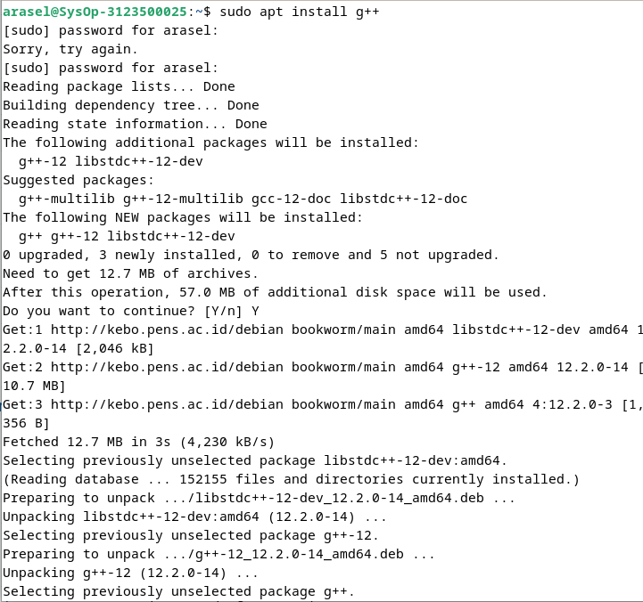
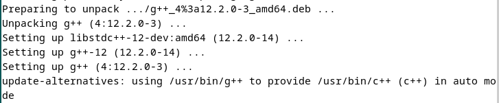

Create & edit file :

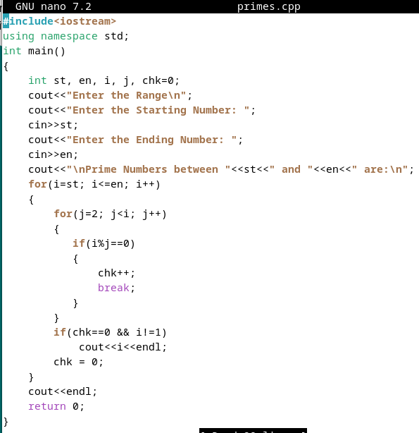

Compile and Run Code :

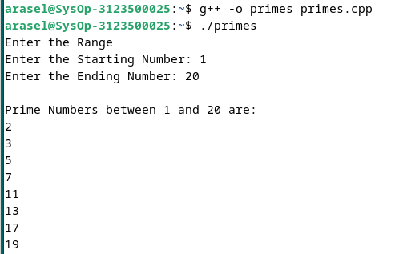

Analisa :
Program cpp diatas dapat menginputkan range untuk bilangan prima, kemudian output akan dicetak.

3. Lakukan percobaan-percobaan di bawah ini kemudian analisa hasil percobaan.
4. Selesaikan soal-soal latihan.

**Percobaan 1 : Status Proses**

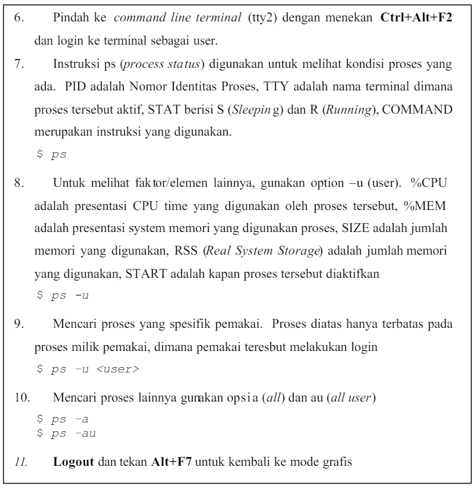

7.Instruksi ps

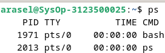

Analisa :
ps digunakan untuk melihat proses yang sedang berjalan.

8.Instruksi ps -u

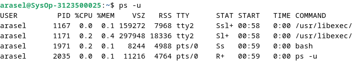

Analisa :
ps -u digunakan untuk menampilkan user yang kita gunakan.

9.ps -u user

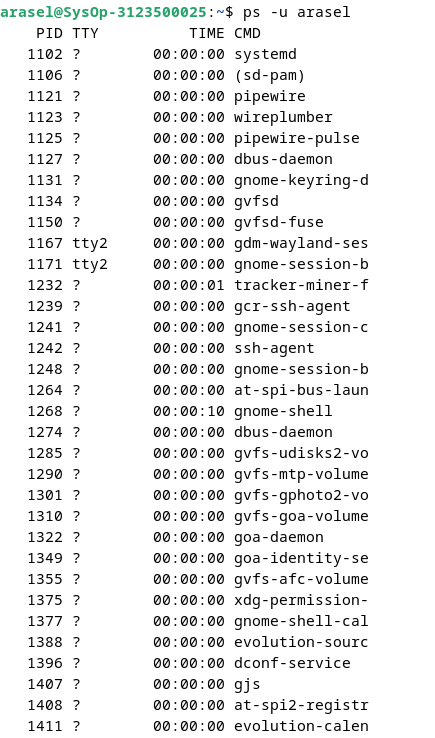
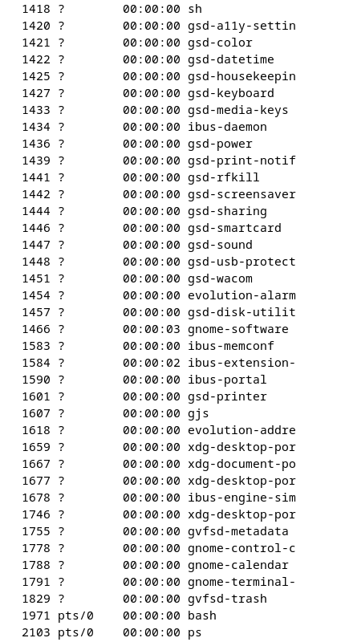

Analisa :
Untuk menampilkan proses khusus user yang kita inginkan.

10.ps -a dan ps -au

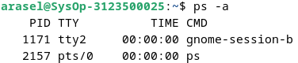

Analisa :
Digunakan untuk menampilkan proses pada user saat ini.

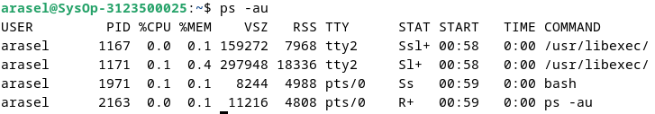

Analisa :
Digunakan untuk menampilkan proses semua user.

**Percobaan 2 : Menampilkan Hubungan Proses Parent dan Child**

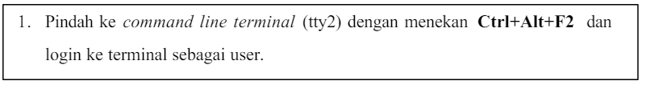

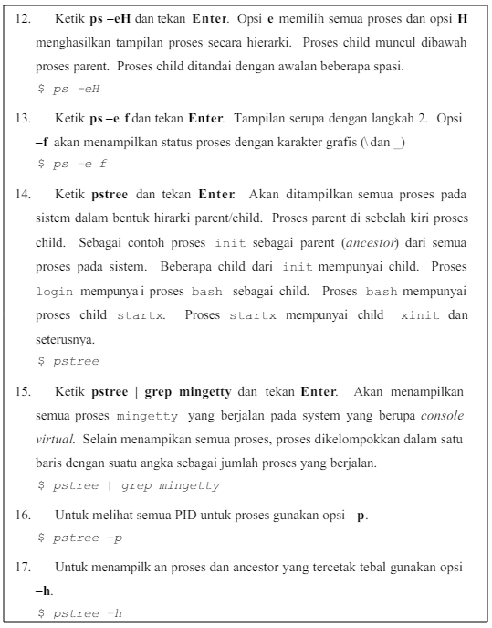

12.ps -eH

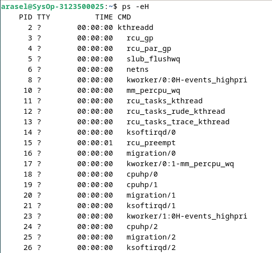

Analisa :
ps -eH digunakan untuk melihat semua proses yang sedang berjalan dengan struktur hierarki.

13.ps -ef

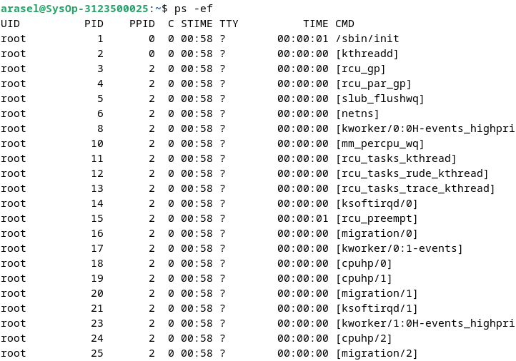

Analisa :
Perintah ini serupa dengan percobaan kedua, tetapi menambahkan opsi f untuk menampilkan STAT (status) proses, seperti S (sleeping) atau R (running).

14.pstree

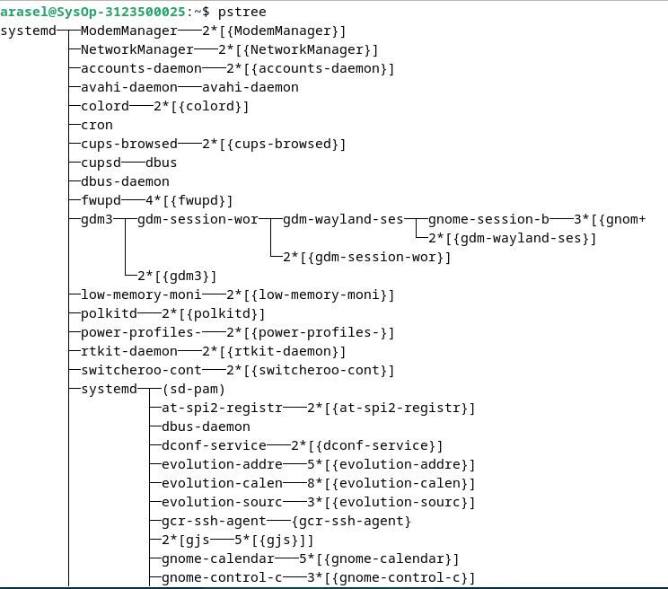

Analisa :
Gambar diatas tampak struktur berupa sebuah pohon atau diagram. Yang menyatakan system ditampilkan dalam bentuk hirarki parent/child. Proses parent disebelah kiri proses child.Sebagai contoh proses init sebagai parent (ancestor) dari semua proses pada sistem. Beberapa child dari init mempunyai child. Proses login mempunyai proses bash sebagai child. Proses bash mempunyai proses child startx. Proses startxmempunyai child xinit dan seterusnya hingga membentuk seperti pohon.

15.pstree grep mingetty

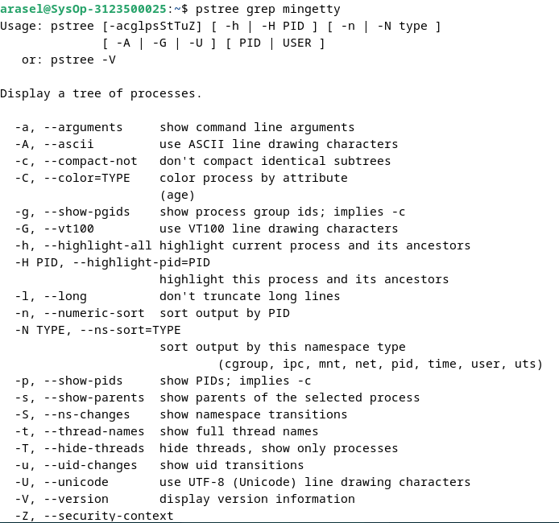

Analisa :
pstree grep mingetty digunakan untuk menampilkan semua proses mingetty yang berjalan pada system yang berupa console virtual.

16.pstree -p

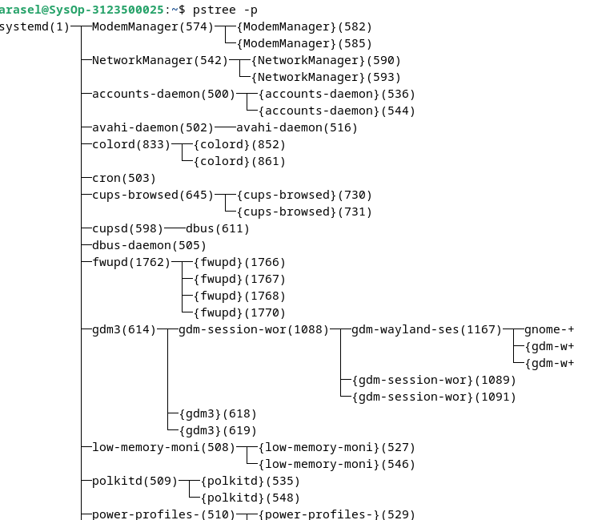

Analisa :
pstree -p digunakan untuk menampilkan data seperti diagram pohon dengan tambahan informasi PID proses melalui opsi -p.

17.pstree -h

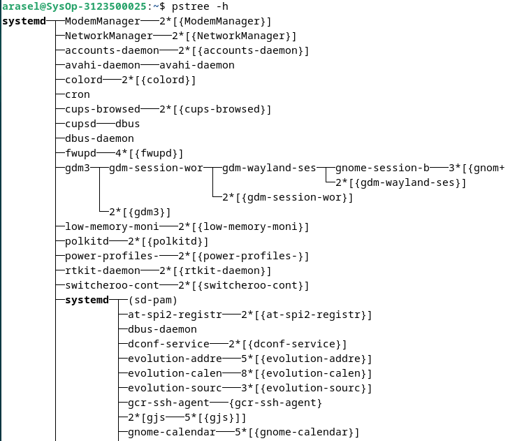

Analisa :
pstree -h digunakan untuk menampilkan proses dan ancestor dengan cara ditampilkan atau dicetak tebal.

**Percobaan 3 : Menampilkan Status Proses dengan Berbagai Format**

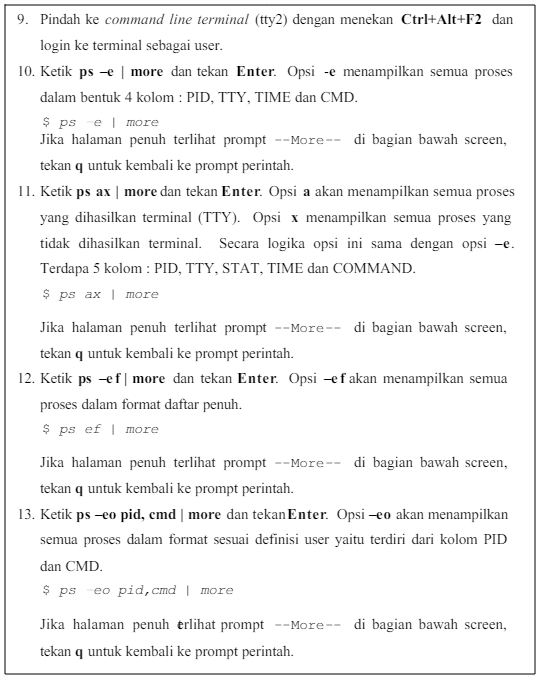

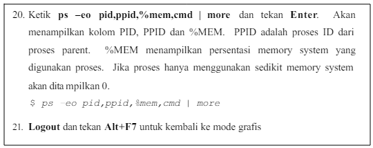

10.ps -e | more

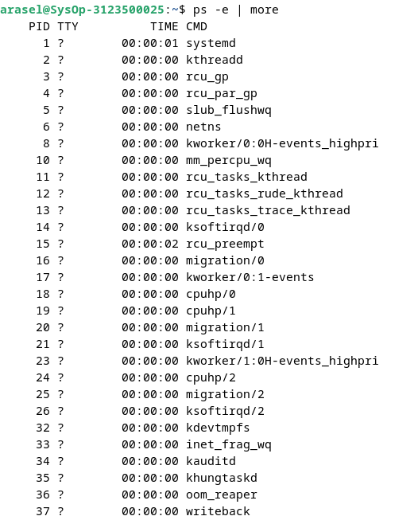

Analisa :
Perintah ps -e | more digunakan untuk menampilkan semua proses dalam bentuk 4 kolom :PID, TTY, TIME dan CMD.Yang kemudian disortir dengan menggunakan More.

11.ps ax | more

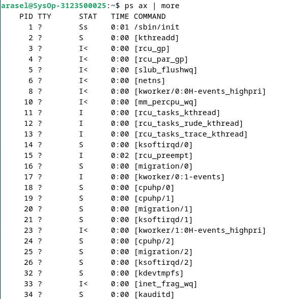

Analisa :
Perintah ps -ax | more digunakan untuk menampilkan semua proses dalam bentuk 4 kolom :PID, TTY, STAT, TIME dan CMD.Yang kemudian disortir dengan menggunakan More.

12.ps -ef | more

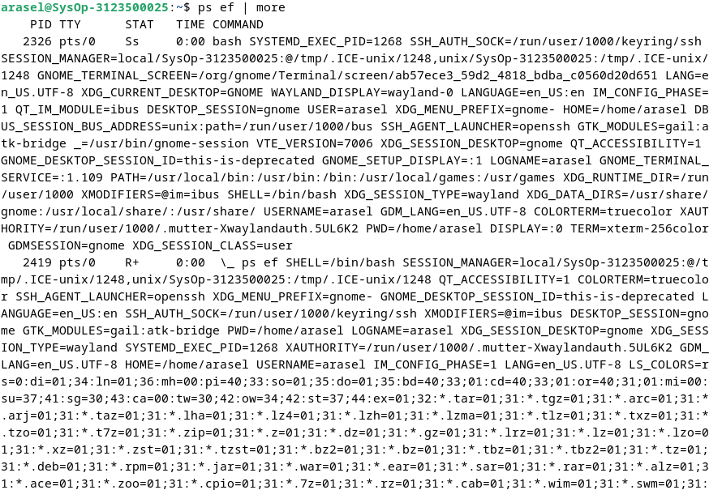

Analisa :
Perintah ps -ef | more digunakan untuk menampilkan semua proses dalam format daftar penuh dan disortir dengan menggunakan More.

13.ps -eo pid,cmd | more

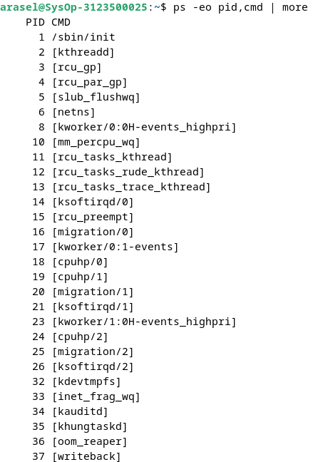

Analisa :
Perintah $ ps -eo pid,cmd | more digunakan untuk menampilkan semua proses yang hanya menunjukkan kolom PID dan CMD, dan outputnya disortir dengan More.

14.ps -eo pid,ppid,%mem,cmd | more

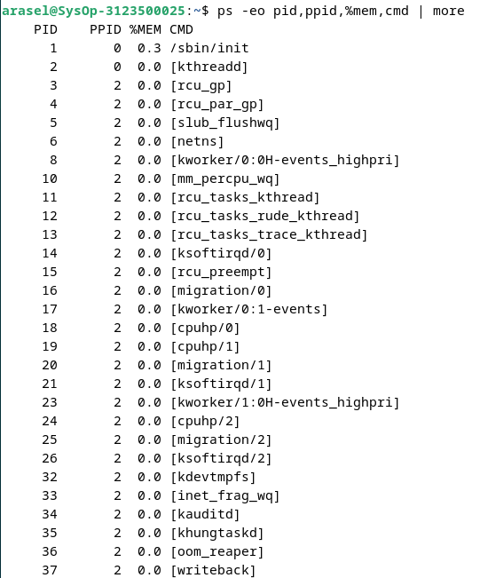

Analisa :
Perintah $ ps -eo pid,ppid,%mem,cmd | more digunakan untuk menampilkan kolom PID, PPID, %MEM, dan CMD dari semua proses, di mana PPID adalah ID proses parent dan %MEM adalah persentase memori sistem yang digunakan proses, dan outputnya disortir dengan More.

**Percobaan 4 : Mengontrol proses pada shell**

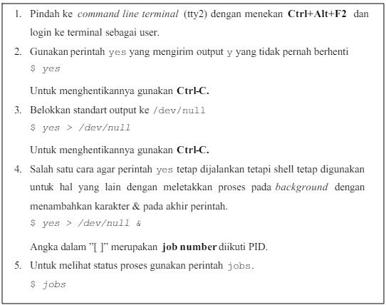

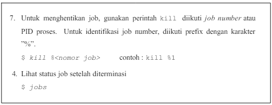

2.yes

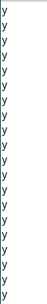

Analisa :
erintah yes digunakan untuk mengirim output y yang tidak pernah berhenti.

3.yes > /dev/null

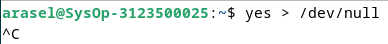

Analisa :
Perintah tersebut digunakan membelokan standart output dari yes ke /dev/null.

4.yes > /dev/null &

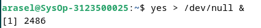

Analisa :
perintah yes tetap dijalankan tetapi shell lain tetap digunakan untuk hal laindengan meletakkan proses pada background dengan menambah karakter & pada akhir perintah[1] merupakan job number pid.

5.jobs

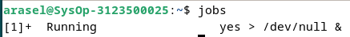

Analisa :
Perintah jobs digunakan untuk melihat proses yang sedang atau telah dijalankan.

6.kill % nomor job

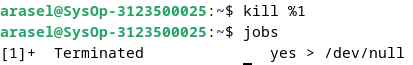

Analisa :
kill % nomor job digunakan untuk menghentikan job untuk yes. Dan obs digunakan untuk melihat proses yang sedang atau telah dijalankan.

**KESIMPULAN**

Proses di Linux merupakan program yang sedang berjalan dan menjalankan berbagai tugas, di mana setiap proses memiliki identitas unik (PID) dan dialokasikan sumber daya seperti memori dan CPU. Manajemen proses yang efektif sangat penting untuk menjaga kinerja dan stabilitas sistem. Memahami dan menggunakan kombinasi ps, top, dan kill adalah kunci untuk mengelola proses di Linux.
