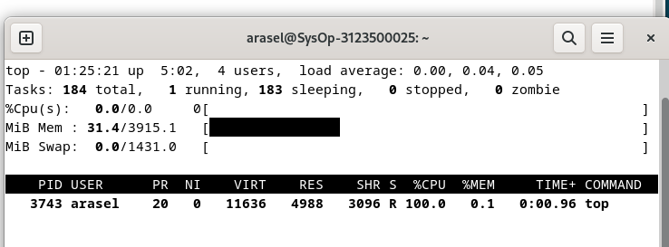

  <h2 style="text-align: center;font-weight: bold">LAPORAN PRAKTIKUM 6 SISTEM OPERASI </h2>
  <h4 style="text-align: center;">Dosen Pengampu : Dr. Ferry Astika Saputra, S.T., M.Sc.</h4>

 

  
  <h3 style="text-align: center;">Disusun Oleh :  Kelompok 7</h3>
  

    <strong>Achmad Risel Araby (3123500025)</strong> 
    <strong>Danur Isa Prabutama (3123500023)</strong> 
    <strong>Fikri Athanabil Efendi (3123500012)</strong>

  

<h3 style="text-align: center;line-height: 1.5">Politeknik Elektronika Negeri Surabaya Departemen Teknik Informatika Dan Komputer Program Studi Teknik Informatika 2024/2025</h3>
  

**Praktikum4 B**

**Proses dan Manajemen Proses **

**POKOK BAHASAN:**

- Proses pada Sistem Operasi Linux
- Manajemen Proses pada Sistem Operasi Linux

**TUJUAN BELAJAR:**

Setelah mempelajari materi dalam bab ini, mahasiswa diharapkan mampu:

- Memahami konsep proses pada sistem operasi Linux.
- Menampilkan beberapa cara menampilkan hubungan proses parent dan child.
- Menampilkan status proses dengan beberapa format berbeda.
- Melakukan pengontrolan proses pada shell.
- Memahami penjadwalan prioritas.

**DASAR TEORI:**

**1 KONSEP PROSES PADA SISTEM OPERASI LINUX**

Proses adalah program yang sedang dieksekusi. Setiap kali menggunakan utilitas sistem atau program aplikasi dari shell, satu atau lebih proses ”child” akan dibuat oleh shell sesuai perintah yang diberikan. Setiap kali instruksi diberikan pada Linux shell, maka kernel akan menciptakan sebuah proses-id. Proses ini disebut juga dengan terminology Unix sebagai sebuah Job. Proses Id (PID) dimulai dari 0, yaitu proses INIT, kemudian diikuti oleh proses berikutnya (terdaftar pada /etc/inittab).

Beberapa tipe proses :

- **Foreground**

  Proses yang diciptakan oleh pemakai langsung pada terminal (interaktif, dialog)

31

**PRAKTIKUM 4 PROSES DAN MANAJEMEN PROSES** 38

- **Batch**

  Proses yang dikumpulkan dan dijalankan secara sekuensial (satu persatu). Prose Batch tidak diasosiasikan (berinteraksi) dengan terminal.

- **Daemon**

  Proses yang menunggu permintaan (request) dari proses lainnya dan menjalankan tugas sesuai dengan permintaan tersebut. Bila tidak ada request, maka program ini akan berada dalam kondisi “idle” dan tidak menggunakan waktu hitung CPU.

  Umumnya nama proses daemon di UNIX berakhiran d, misalnya inetd, named, popd dll

**2 SINYAL**

Proses dapat mengirim dan menerima sinyal dari dan ke proses lainnya. Proses mengirim sinyal melalui instruksi “kill” dengan format

kill [-nomor sinyal] PID

Nomor sinyal : 1 s/d maksimum nomor sinyal yang didefinisikan system

Standar nomor sinyal yang terpenting adalah :

| **No Sinyal** | **Nama**        | **Deskripsi**                                                                         |
| ------------- | --------------- | ------------------------------------------------------------------------------------- |
| 1             | SIGHUP          | Hangup, sinyal dikirim bila proses terputus, misalnya melalui putusnya hubungan modem |
| 2             | SIGINT          | Sinyal interrupt, melalui ^C                                                          |
| 3 9           | SIGQUIT SIGKILL | 
Sinyal Quit, melalui ^\ 

Sinyal Kill, menghentikan proses 
               |
| 15            | SIGTERM         | Sinyal terminasi software                                                             |

**3 MENGIRIM SINYAL**

Mengirim sinyal adalah satu alat komunikasi antar proses, yaitu memberitahukan proses yang sedang berjalan bahwa ada sesuatu yang harus dikendalikan. Berdasarkan sinyal yang dikirim ini maka proses dapat bereaksi dan

administrator/programmer dapat menentukan reaksi tersebut. Mengirim sinyal menggunakan instruksi

kill [-nomor sinyal] PID

Sebelum mengirim sinyal PID proses yang akan dikirim harus diketahui

terlebih dahulu.

**4 MENGONTROL PROSES PADA SHELL**

Shell menyediakan fasilitas job control yang memungkinkan mengontrol beberapa job atau proses yang sedang berjalan pada waktu yang sama. Misalnya bila melakukan pengeditan file teks dan ingin melakukan interrupt pengeditan untuk mengerjakan hal lainnya. Bila selesai, dapat kembali (_switch_) ke editor dan melakukan pengeditan file teks kembali.

Job bekerja pada **foreground** atau **background**. Pada _foreground_ hanya diperuntukkan untuk satu job pada satu waktu. Job pada _foreground_ akan mengontrol shell - menerima input dari keyboard dan mengirim output ke layar. Job pada background tidak menerima input dari terminal, biasanya berjalan tanpa memerlukan interaksi.

Job pada _foreground_ kemungkinan dihentikan sementara (suspend), dengan menekan [Ctrl-Z]. Job yang dihentikan sementara dapat dijalankan kembali pada _foreground_ atau _background_ sesuai keperluan dengan menekan ”**fg**” atau ”**bg**”. Sebagai catatan, menghentikan job sementara sangat berbeda dengan melakuakan interrupt job (biasanya menggunakan [Ctrl-C]), dimana job yang diinterrup akan dimatikan secara permanen dan tidak dapat dijalankan lagi.

**5 MENGONTROL PROSES LAIN**

Perintah ps dapat digunakan untuk menunjukkan semua proses yang sedang berjalan pada mesin (bukan hanya proses pada shell saat ini) dengan format :

ps –fae atau

ps -aux

Beberapa versi UNIX mempunyai utilitas sistem yang disebut top yang menyediakan cara interaktif untuk memonitor aktifitas sistem. Statistik secara detail

dengan proses yang berjalan ditampilkan dan secara terus-menerus di-_refresh_. Proses ditampilkan secara terurut dari utilitas CPU. Kunci yang berguna pada\* top adalah

s – set update frequency

u – display proses dari satu user

k – kill proses (dengan PID)

q – quit

Utilitas untuk melakukan pengontrolan proses dapat ditemukan pada sistem UNIX adalah perintah killall. Perintah ini akan menghentikan proses sesuai PID atau job number proses.

**Percobaan 5 : Menghentikan dan memulai kembali job**

1. Cara lain meletakkan job pada _background_ dengan memulai job secara normal (pada _foreground_), **stop** job dan memulai lagi pada _background_

   $ _yes > /dev/null_

Hentikan sementara job (_suspend_), bukan menghentikannya (_terminate_), tetapi menghentikan sementara job sampai di restart. Untuk menghentikan sementara job gunakan **Ctrl-Z**.

Analisa :

2. Untuk restart job pada _foreground_, gunakan perintah fg.

   $ _fg_

Analisa :
Perintah fg digunakan untuk menampilkan proses pada foreground.

3. Shell akan menampilkan nama perintah yang diletakkan di _foreground_. Stop job lagi dengan **Ctrl-Z**. Kemudian gunakan perintah bg untuk meletakkan job pada _background_.

   $ _bg_

Analisa :
Perintah bg digunakan untuk melihat proses yang berjalan di background.

Job tidak bisa dihentikan dengan **Ctrl-Z** karena job berada pada _background_. Untuk menghentikannya, letakkan job pada _foreground_ dengan fg dan kemudian hentikan sementara dengan **Ctrl-Z**.

$ _fg_

Analisa :
Perintah fg digunakan untuk menampilkan proses pada foreground.

4. Job pada _background_ dapat digunakan untuk menampilkan teks pada terminal, dimana dapat diabaikan jika mencoba mengerjakan job lain.

   $ _yes &_

   Untuk menghentikannya tidak dapat menggunakan **Ctrl-C.** Job harus dipindah ke _foreground_, baru dihentikan dengan cara tekan **fg** dan tekan **Enter**, kemudian dilanjutkan dengan **Ctrl-Z** untuk menghentikan sementara.

Analisa :
Menjalankan sebuah proses lalu menghentikannya.

5. Apabila ingin menjalankan banyak job dalam satu waktu, letakkan job pada _foreground_ atau _background_ dengan memberikan job ID

   $ _fg %2_ atau $ _%2_ $ _bg %2_

Analisa :

6. tekan **fg** dan tekan **Enter**, kemudian dilanjutkan dengan **Ctrl-Z** untuk menghentikan sementara.

Analisa :
Percobaan untuk menghentikan proses yes.

7. Lihat job dengan perintah **ps -fae** dan tekan **Enter**. Kemudian hentikan proses dengan perintah kill.

   $ _ps -fae_

   $ _kill -9 NomorPID_

Analisa :
Perintah kill digunakan untuk menghentikan suatu proses.

8. **Logout** dan tekan **Alt+F7** untuk kembali ke mode grafis

**Percobaan 6 : Percobaan dengan Penjadwalan Prioritas**

1. Login sebagai root.
2. Buka 3 terminal, tampilkan pada screen yang sama.
3. Pada setiap terminal, ketik **PS1 = ”\w:”** diikuti **Enter**. **\w** menampilkan path pada direktori home.
4. Karena login sebagai root, maka akan ditampilkan **~:** pada setiap terminal. Untuk setiap terminal ketik **pwd** dan tekan **Enter** untuk melihat bahwa Anda sedang berada pada direktori /root.

Analisa :
Masuk ke root dengan sudo su, mengikuti perintah sesuai arahan percobaan.

5. Buka terminal lagi (keempat), atur posisi sehingga keempat terminal terlihat

pada screen.

6. Pada terminal keempat, ketik **top** dan tekan **Enter.** Maka program top akan muncul. Ketik **i**. **Top** akan menampilkan proses yang aktif. Ketik **lmt**. **Top** tidak lagi menampilkan informasi pada bagian atas dari screen. Pada percobaan ini, terminal ke empat sebagai jendela **Top**.

Ketik lmt :

7. Pada terminal 1, bukalah program executable C++ dengan mengetik program **yes** dan tekan **Enter.**
8. Ulangi langkah 7 untuk terminal 2.

Analisa :
Menjalankan perintah yes pada terminal 1 & 2, perintah i untuk melihat proses yang berjalan, perintah lmt untuk menghilangkan informasi pada bagian atas jendela.

9. Jendela **Top** akan menampilkan dua program yes sebagai proses yang berjalan. Nilai %CPU sama pada keduanya. Hal ini berarti kedua proses mengkonsumsi waktu proses yang sama dan berjalan sama cepat. PID dari kedua proses akan berbeda, misalnya 3148 dan 3149. Kemudian gunakan

   terminal 3 (yang tidak menjalankan primes maupun Jendela **Top**) dan ketik **renice 19 <PID terimnal 1>** (contoh : **renice 19 3148**) dan diikuti **Enter**. Hal ini berarti mengganti penjadwalan prioritas dari proses ke 19.

Analisa :
Sebelum kita melakukan renice pada PID 3752 terlihat kolom Ni masih terisi dengan 0, lalu berubah menjadi 19.

10. Tunggu beberapa saat sampai program top berubah dan terlihat pada jendela **Top**. Pada kolom STAT memperlihatkan N untuk proses 3148. Hal ini berarti bahwa penjadwalan prioritas untuk proses 3148 lebih besar (lebih lambat) dari 0. Proses 3149 berjalan lebih cepat.

11. Program top juga mempunyai fungsi yang sama dengan program renice. Pilih Jendela **Top** dan tekan **r**. Program top terdapat prompt **PID to renice:** tekan **3148** (ingat bahwa Anda harus mengganti 3148 dengan PID

    Anda sendiri) dan tekan **Enter**. Program top memberikan prompt **Renice PID 3148 to value:** tekan -**19** dan tekan **Enter**.

Analisa :
Selain menggunakan renice, mengubah penjadwalan prioritas di top dapat dilakukan dengan menekan r lalu inputkan PID dan valuenya.

12. Tunggu beberapa saat sampai top berubah dan lihat nilai %CPU pada kedua proses. Sekarang proses 3148 lebih cepat dari proses 3149. Kolom status menunjukkan < pada proses 3148 yang menunjukkan penjadwalan prioritas lebih rendah (lebih cepat) dari nilai 0.
13. Pilih terminal 3 (yang sedang tidak menjalankan yes atau program top) dan ketik **nice –n -10 yes** dan tekan **Enter.** Tunggu beberapa saat agar

    program top berubah dan akan terlihat proses primes ketiga. Misalnya PID nya 4107. Opsi -10 berada pada kolom NI (penjadwalan prioritas).

Analisa :
Menambahkan program primes baru di terminal ketiga menggunakan perintah nice -n -10 yes.

14. Jangan menggunakan mouse dan keyboard selama 10 detik. Program top menampilkan proses yang aktif selain program yes. Maka akan terlihat proses top terdaftar tetapi %CPU kecil (dibawah 1.0) dan konsisten. Juga terlihat proses berhubungan dengan dekstop grafis seperti X, panel dll.

15. Pindahkan mouse sehingga kursor berubah pada screen dan lihat apa yang

    terjadi dengan tampilan top. Proses tambahan akan muncul dan nilai %CPU berubah sebagai bagian grafis yang bekerja. Satu alasan adalah bahwa proses 4107 berjalan pada penjadwalan prioritas tinggi. Pilih jendela **Top**, ketik **r**. **PID to renice** : muncul prompt. Ketik **4107** (ubahlah 4107 dengan PID Anda) dan tekan **Enter**. **Renice PID 4107 to value:** muncul

    prompt. Ketik **0** dan tekan **Enter**. Sekarang pindahkan mouse ke sekeliling screen. Lihat perubahannya.

Analisa :
Terlihat bahwa PID yang kita inputkan menghilang dan PID 1259 menjadi prioritas.

16. Tutup semua terminal window.
17. Logout dan login kembali sebagai user.

**LATIHAN:**

A. Masuk ke tty2 dengan **Ctrl+Alt+F2**. Ketik **ps –au** dan tekan **Enter.** Kemudian perhatikan keluaran sebagai berikut :

1. Sebutkan nama-nama proses yang bukan root.

Jawab :

User = arasel pid = 1157 cmd = /user/libexec/

User = arasel pid = 1160 cmd = /user/libexec/

User = arasel pid = 2806 cmd = bash

User = arasel pid = 2809 cmd = ps -au

2. Tulis PID dan COMMAND dari proses yang paling banyak enggunakan CPU time.

Jawab :

User = arasel pid = 2809 cmd = ps -au

3. Sebutkan buyut proses dan PID dari proses tersebut.

Jawab :

User = arasel pid = 1157 cmd = /user/libexec/

4. Sebutkan beberapa proses daemon.

Jawab :

Analisa : Tidak ada proses daemon.

5. Pada prompt login lakukan hal-hal sebagai berikut :

$csh $who $bash
$ls $sh $ps

Analisa :
Perintah $sh digunakan untuk menjalankan skrip shell shell script dengan menyebutkan nama file skrip setelah perintah ini. $who digunakan untuk melihat informasi pengguna yang terhubung. $bash digunakan untuk mengkonversi instruksi yang dimasukkan ke dalam bahasa biner yang dapat di mengerti oleh kernel Linux. $ls digunakan untuk melihat daftar file dan direktori di direktori kerja saat ini.

6. Sebutkan PID yang paling besar dan kemudian buat urut-urutan proses sampai ke PPID = 1.

Analisa :
Menampilkan urutan proses dari PID terbesar hingga PID 1.

B. Cobalah format tampilan ps dengan opsi berikut dan perhatikan hasil tampilannya :

- **-f** daftar penuh
  

  Analisa :
  Perintah -f digunakan untuk menampilkan output dalam format yang lengkap atau penuh.

- **-j** format job
  

  Analisa :
  Perintah -j digunakan untuk menampilkan informasi tentang job control untuk setiap proses.

- **j** format job control
  

  Analisa :
  Perintah j digunakan untuk menampilkan informasi tentang job control untuk setiap proses.

- **l** daftar memanjang
  

  Analisa :
  Perintah l digunakan untuk menampilkan output dalam format yang lebih panjang atau rinci.

- **s** format sinyal
  

  Analisa :
  Perintah s digunakan untuk menampilkan informasi tentang sinyal yang dikirimkan kepada proses.

- **v** format virtual memory
  

  Analisa :
  Perintah v digunakan untuk menampilkan informasi tentang penggunaan memori virtual oleh setiap proses.

- **X** format register i386
  

  Analisa :
  Perintah X digunakan untuk menampilkan semua proses, bahkan yang tidak terkait dengan terminal pengguna (tidak terkendali).

C. Lakukan urutan pekerjaan berikut :

1. Gunakan perintah find ke seluruh direktory pada sistem, belokkan output sehingga daftar direktori dialihkan ke file directories.txt dan daftar pesan error dialihkan ke file errors.txt
   
2. Gunakan perintah sleep 5. Apa yang terjadi dengan perintah ini ?
   

   Analisa :
   Perintah sleep digunakan untuk membuat proses tertunda (sleep) dalam sistem operasi Unix/Linux untuk jangka waktu tertentu yang ditentukan sebelum melanjutkan eksekusi perintah berikutnya.

3. Jalankan perintah pada _background_ menggunakan &
   

   Analisa :
   Proses berjalan di background dengan nomor PID yang telah ditampilkan.

4. Jalankan sleep 15 pada _foreground_, hentikan sementara dengan Ctrl-Z dan kemudian letakkan pada _background_ dengan bg. Ketikkan jobs. Ketikkan ps. Kembalikan job ke _foreground_ dengan perintah\*\* fg.
   

   Analisa :
   Pertama menjalankan perintah sleep 20 & yang menjadikan proses sleep berjalan di latar belakang dengan PID 3223. Kemudian menjalankan perintah sleep 15 yang menjalankan proses sleep lain di latar depan dan menekan Ctrl+Z, proses tersebut dihentikan sementara. Kemudian menjalankan perintah bg yang menempatkan proses sleep 15 yang dihentikan sebelumnya ke latar belakang. Kemudian menjalankan perintah bg yang menempatkan proses sleep 15 yang dihentikan sebelumnya ke latar belakang. Perintah ps dijalankan untuk melihat daftar semua proses yang sedang berjalan. Dan menjalankan perintah fg yang membawa proses sleep 15 yang berjalan di latar belakang ke latar depan.

5. Jalankan sleep 15 pada _background_ menggunakan & dan kemudian gunakan perintah kill untuk menghentikan proses diikuti _job number_.
   

   Analisa :
   Sleep 15 akan berjalan di latar belakang dan kemudian menghentikan proses tersebut menggunakan perintah kill dengan menyertakan nomor pekerjaan yang terkait dengan proses tersebut.

6. Jalankan sleep 15 pada _background_ menggunakan & dan kemudian gunakan kill untuk menghentikan sementara proses. Gunakan bg untuk melanjutkan menjalankan proses.
   

   Analisa :
   menjalankan perintah sleep 15 di latar belakang, lalu menghentikannya dengan kill -STOP %1, dan memindahkannya ke latar depan dengan bg.

7. Jalankan sleep 60 pada _background_ 5 kali dan terminasi semua pada dengan menggunakan perintah killall.
   

   Analisa :
   Menjalankan beberapa proses sleep 60 detik di latar belakang, kemudian menggunakan perintah killall untuk menghentikan semua proses sleep tersebut sebelum selesai waktunya.

8. Gunakan perintah ps, w dan top untuk menunjukkan semua proses yang sedang dieksekusi.
   

   Analisa :
   Menggunakan perintah ps untuk melihat proses yang sedang berjalan, dan menjalankan perintah w yang menampilkan informasi beban sistem (load average), pengguna yang sedang login, waktu login, waktu idle, dan penggunaan CPU beserta proses yang sedang berjalan.

9. Gunakan perintah ps –aeH untuk menampilkan hierarki proses. Carilah init proses. Apakah Anda bisa identifikasi sistem daemon yang penting ? Dapatkan Anda identifikasi shell dan subproses ?
   
   
   

   Analisa :
   Perintah ps -aeH menunjukkan hierarki proses, namun proses init dengan PID 1 tidak ditemukan. Karena pada beberapa sistem Linux modern, seperti yang menggunakan systemd sebagai inisiasi (init system), proses dengan PID 1 bukan lagi proses init tradisional. Systemd sendiri dijalankan sebagai proses dengan PID 1, mengikuti arsitektur baru yang diterapkan pada banyak distribusi Linux modern.

10. Kombinasikan ps –fae dan grep, apa yang Anda lihat ?
    

    Analisa :
    Perintah "grep" yang digunakan untuk mencari baris yang mengandung teks "tty2" dalam daftar proses yang dihasilkan oleh perintah "ps".

11. Jalankan proses sleep 300 pada _background_. Log off komputer dan log in kembali. Lihat daftar semua proses yang berjalan. Apa yang terjadi pada proses sleep ?
    
    

**LAPORAN RESMI:**

1. Analisa hasil percobaan yang Anda lakukan.
1. Kerjakan latihan diatas dan analisa hasil tampilannya.
1. Berikan kesimpulan dari praktikum ini.
