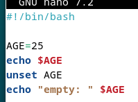
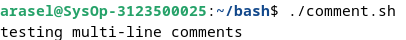
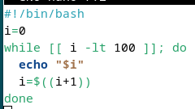
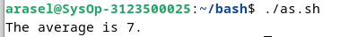
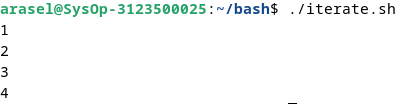

<div align="center">
  <h1 style="text-align: center;font-weight: bold">LAPORAN PRAKTIKUM 8 SISTEM OPERASI</h1>
  <h4 style="text-align: center;">Dosen Pengampu : Dr. Ferry Astika Saputra, S.T., M.Sc.</h4>
</div>
<br />
<div align="center">
  
  <h3 style="text-align: center;">Disusun Oleh : </h3>
  <p style="text-align: center;">
    <strong>Achmad Risel Araby (3123500025)</strong><br>
    <strong>Danur Isa Prabutama (3123500023)</strong><br>
    <strong>Fikri Athanabil Efendi (3123500012)</strong>
  </p>
<h3 style="text-align: center;line-height: 1.5">Politeknik Elektronika Negeri Surabaya<br>Departemen Teknik Informatika Dan Komputer<br>Program Studi Teknik Informatika<br>2023/2024</h3>
  <hr><hr>
</div>

## Bash Programming

### Apa itu bash?

Bash, kependekan dari Bourne Again Shell, adalah open source command line interpreter dan scripting language. Ini menafsirkan perintah yang dimasukkan pengguna, baik secara interaktif atau dari file skrip.

Ini berfungsi sebagai interface untuk memanggil perintah, memungkinkan system function calls.

Ada 2 tipe dari mode bash

- **Interactive Mode**
  Juga disebut sebagai command intepreter, memungkinkan eksekusi perintah di terminal. Ini mengeksekusi perintah secara berurutan jika ada beberapa perintah.

- **Non-interactive Mode**
  Ini merujuk pada scrpts, memungkinkan Anda menulis Bash syntax yang berisi rangkaian beberapa perintah untuk eksekusi skrip.

### Apa Perbedaan dari Bash dan Shell

Shell, an alias for Bourne Shell, adalah command-line interpreter untuk OS Unix dan Linux. Bash, alias Bourne Again Shell, adalah versi yang disempurnakan.

### Untuk apa skrip bash digunakan?

Skrip Bash memiliki banyak kasus penggunaan, termasuk:

- Menulis skrip untuk mengotomatiskan tugas pemrograman
- Menyinkronkan tugas untuk menyalin file
- Menjalankan tugas cron untuk penjadwalan

### Bagaimana cara menulis kode di bash?

Untuk menulis kode dalam skrip Bash, ikuti langkah-langkah berikut:

- Di terminal, buat file menggunakan `vi test.sh`.
- Tambahkan `#!/bin/bash` di bagian atas file.
- Tambahkan beberapa cuplikan kode shell.
- Simpan file shell dengan `.sh` ekstensi.
- Jalankan skrip shell menggunakan `./test.sh` perintah di terminal.

### Apakah bash termasuk bahasa pengkodean?

Bash menjalankan perintah dari terminal atau file. Ini adalah bahasa pemrograman yang beroperasi pada sistem operasi kernel Unix/Linux, berisi semua fitur untuk menulis kode lengkap.

Bash adalah tipe shell khusus yang menerima masukan dari perintah, menjalankan kode, dan memproses masukan, serta mengembalikan hasilnya.

### Jenis Shell

Ada berbagai jenis shell di OS Unix.

<table>
<thead>
<tr>
  <th style="background-color: blue; color: white">Tipe Cangkang</th>
  <th style="background-color: blue; color: white">Alias</th>
  <th style="background-color: blue; color: white">Garis Pertama</th>
<tr>
</thead>
<tbody>
  <tr>
  <td>SH</td>
  <td>Bourne Shell</td>
  <td>#!/bin/sh</td>
  </tr>
   <tr>
  <td>bash</td>
  <td>Bourne Again Shell</td>
  <td>#!/bin/bash</td>
  </tr>
   <tr>
  <td>cshell</td>
  <td>C shel</td>
  <td>#!/bin/csh</td>
  </tr>
</tbody>
</table>

| tcsh | TENEX C shell | #!/bin/tcsh | | | | ksh | Korn shell | #!/bin/ksh |

### Perbedaan dari Command Line dan Script di bash

Mari kita lihat perbedaan antara baris perintah dan skrip

Opsi baris perintah

- Baris perintah memiliki prompt yang menerima masukan dari pengguna
- Perintah tidak disimpan ke file.
- Ini hanya mendukung satu perintah pada satu waktu.

File skrip

- Mendukung banyak perintah dalam satu file
- Prompt masih dapat ditulis dalam file skrip
- Hanya satu baris dalam sebuah file yang dijalankan secara berurutan

## Bash - Variables

**Deklarasi Variable**: Untuk membuat variable, maka harus memberikan nilai padanya

```
variableName=VariableValue
```

Keterangan:

- variableName: dapat berisi kombinasi huruf apa saja, angka, dan garis bawah
- variableValue: adalah nilai yang disimpan dalam variabel, dan dapat berupa angka, string atau boolean. Simbol `=` digunakan untuk memberikan nilai pada suatu variabel.

Misalnya

```
AGE=25
```

### Cara mengakses variabel di bash


Pertama adalah mendeklarasikan variable _AGE_ dengan memberikan nilai 25. Kemudian menggunakan `echo` untuk menampilkan outputnya. Simbol dollar `$` sebelum nama variable sangat penting untuk mengakses nilainya.


### Bash Shell readonly variables


Setelah variabel diberi nilai, kita dapat mengubahnya ke nilai baru menggunakan operator penugasan =


**Membuat Variable tidak dapat diperbarui**


keyword `readonly` mencegah variable untuk diperbarui, secara efektif mengubahnya menjadi `constant`.


### Bash Unset Variable

Keyword `unset` membantu menghilangkan nilai dari variable yang ditentukan. Variable tetap dapat diakses tetapi mencetak nilai kosong.



Output:


### Variables Scope

Setiap variabel yang dideklarasikan harus memiliki ruang lingkup, yang menentukan di mana variabel tersebut dapat digunakan dalam program.

Misalnya, jika suatu variabel dideklarasikan di dalam suatu fungsi, maka variabel tersebut hanya tersedia di dalam fungsi tersebut dan tidak dapat diakses di luar fungsi tersebut.

Cakupan variabel di Bash dapat didefinisikan dengan dua cara

- Variabel global
- Variabel lokal

### Variable Global Bash

### Bash Local Bash

### Variables Typing

### Display Environment

### Variable nameing covention

### Shell variables

## Bash - Loop File

Terkadang kita ingin membaca konten file menggunakan bash programming.
Ada berbagai macam cara yang dapat kita lakukan

### Bagaimana cara membaca file demi baris di bash Shell?

- menggunakan perulangan while


Output


Output diatas merupakan isi dari file `filename.txt`


## Bash - Comments

Posting ini menjelaskan cara menulis komentar dalam skrip bash shell, dengan contoh yang menyertainya.

`Comments` adalah pernyataan kode yang berisi teks yang dapat dibaca pengguna yang dilewati shell selama eksekusi. Setiap bahasa pemrograman menyertakan fitur komentar, yang memberikan deskripsi baris kode atau pernyataan.

Komentar sebaris dalam kode membantu pengembang dalam mengedit dan memahami kode dengan lebih baik.

Bahasa script bash memungkinkan anda menggunakan jenis komentar berikut.

- **Komentar tunggal**
- **Komentar multi-baris**

Komentar berguna bagi manusia, kode ditulis untuk scripting

### Komentar satu baris di bash shell

Komentar satu baris dalam skrip shell dilambangkan dengan `#` simbol di awal setiap baris.

Komentar ini mencakup string yang memberikan informasi tentang baris kode terkait dalam skrip shell.

Penting untuk menempatkan komentar satu baris pada baris terpisah untuk kejelasan.

Untuk komentar sebaris, gunakan simbol `#` di awal komentar. Komentar satu baris selalu dimulai dengan `#` simbol.

**Syntax:**

```
# Single-line comments
```

Spasi kosong setelah `#` simbol tidak diperlukan. Berikut ini adalah contoh komentar satu baris dalam skrip shell.


Output


### Komentar multi-baris dalam skrip shell

Komentar multi-baris melibatkan penggunaan lebih dari satu baris untuk komentar.

Cara pertama untuk membuat komentar multi-baris adalah dengan memanfaatkan komentar satu baris yang setiap barisnya dimulai dengan simbol komentar satu baris.

Syntax:


Cara kedua untuk membuat komentar multi-baris adalah dengan mengapit beberapa baris di dalam (`:`) dan (`'`).

Sintaks ini melibatkan:

- Komentar dimulai dengan titik dua (`:`) diikuti dengan `'`.
- Ini diikuti oleh beberapa baris komentar.
- Komentar diakhiri dengan `'`. Berikut sintaksnya:


Output:



Hal ini berguna untuk memasukkan lebih banyak teks yang mencakup beberapa baris, juga melayani tujuan dokumentasi.

### Kesimpulan

Singkatnya, kita telah mempelajari cara menambahkan komentar tunggal dan multi-baris dalam pemrograman skrip shell.

## Bash - Arrays

Array di shells adalah variable untuk menyimpan lebih dari satu nilai/data.
Misal ketika memiliki data daftar bilangan integer 1-100, dan ingin menyimpan bilangan-bilangan ini di shell script, tanpa array kita harus mendeklarasikannya satu persatu / baris per baris menggunakan `let number1=1` dst. Jadi, anda bisa menggunakan array yang merujuk ke satu variabel dan menyimpannya.

### Bagaimana cara mendeklarasikan dan membuat array?

Ada 2 jenis array yang dapat kita buat

- array yang diindeks: elemen array disimpan dengan indeks mulai dari nol
- array terkait: array disimpan dengan pasangan nilai kunci

**Deklarasi sebuah array**

Untuk membuat array, kita perlu mendeklarasikan array.

```
declares -a array; # indexed array
declare -A array; # associative array
```

Sebuah array dideklarasikan dengan kata kunci declaredengan opsi `-a` atau `A`

**Menetapkan nilai tanpa mendeklarasikan Array**

```
arrayvariable[index]=value
```

Artinya, `arrayvariable[indeks]` array dideklarasikan dan diberi nilai.

Array diindeks nol berdasarkan nol pada panjang array -1 indeks=0 - mengembalikan elemen pertama indeks=-1 mengembalikan elemen terakhir

Array bisa berisi angka, string, dan campurannya. Mari kita buat contoh array.

### Akses nilai Array

Array berisi indeks untuk mendapatkan elemen. Elemen array dapat diakses menggunakan sintaks di bawah ini.

```
${array_name[index]}
```

### Deklarasi Array angka dan Loop

Array dapat berisi angka Contoh ini berisi array angka dan loop for untuk dicetak


Output:


### Deklarasi Array string dan Loop

Array dapat berisi angka Contoh ini berisi array angka dan loop for untuk dicetak


Output:


### Akses elemen pertama array

Dalam elemen Array, indeks elemen Pertama adalah nol, dan array[0] mengembalikan elemen pertama


Output:


### Dapatkan element terakhir dalam sebuah array

Dalam skrip bash, Anda dapat menggunakan indeks=-1 untuk mendapatkan elemen array terakhir.


Dengan versi bash 4.0 terbaru, Anda dapat menggunakan sintaks di bawah ini untuk membaca elemen terakhir.


Output:


### Iterate atau Loop element array

For loop digunakan untuk mengulangi elemen.

Berikut adalah contoh contoh loop array untuk mencetak semua elemen


Output:


Cara lain untuk mencetak indeks dan elemen array menggunakan for loop.


Output:


### Cetak semua elemen array

Gunakan [@] atau [*] untuk mencetak semua elemen array.


Output:


### Hapus elemen dari array

Anda dapat menghapus elemen dari array menggunakan `unset` indeks tertentu.


Output:


### Menambahkan elemen ke array

Anda dapat menambahkan elemen di posisi indeks mana pun menggunakan sintaksis di bawah ini.

```
array[index]=value
```

Contoh penambahan elemen awal dan akhir serta tengah


Output:


### Panjang sebuah array

Dalam hal ini, Temukan jumlah semua elemen dalam array.

Script Shell menyediakan `#`


Output:


### Array cheat sheet

<table>
<thead>
<tr>
  <th style="background-color: blue; color: white">Example</th>
  <th style="background-color: blue; color: white">Description</th>
<tr>
</thead>
<tbody>
    <tr>
        <td>Sdeclare -a array	</td>
        <td>Declare an Indexed array</td>
    </tr>
    <tr>
        <td>declare -A array	</td>
        <td>Declare an Associative array</td>
    </tr>
    <tr>
        <td>declare -a array=()	</td>
        <td>Declare an indexed array with empty array</td>
    </tr>
    <tr>
        <td>array=()</td>
        <td>create an empty array with declaring is valid</td>
    </tr>
    <tr>
        <td>array=(1 6 3)</td>
        <td>Initialize array with numbers</td>
    </tr>
    <tr>
        <td>array=(one two three)</td>
        <td>Initialize the array with string</td>
    </tr>
    <tr>
        <td>array=(one two 1)</td>
        <td>Initialize the array with mixed data</td>
    </tr>
    <tr>
        <td>${array[0]}</td>
        <td>Get first element</td>
    </tr>
    <tr>
        <td>${array[1]}</td>
        <td>Get second element</td>
    </tr>
    <tr>
        <td>${array[-1]}</td>
        <td>Get last element</td>
    </tr>
    <tr>
        <td>${array[@]}</td>
        <td>Get All element</td>
    </tr>
    <tr>
        <td>${array[*]}</td>
        <td>Get All element</td>
    </tr>
    <tr>
        <td>${!array[!]}</td>
        <td>Get All indexes</td>
    </tr>
    <tr>
        <td>${#array[!]}</td>
        <td>Array length</td>
    </tr>
    <tr>
        <td>array[0]=12</td>
        <td>Add element to array at first position.i.e index=0</td>
    </tr>
    <tr>
        <td>array[-1]=22</td>
        <td>Add element to array at last position.</td>
    </tr>
    <tr>
        <td>array+=(11)</td>
        <td>Append value to an array</td>
    </tr>
    <tr>
        <td>${array[@]:k:i}</td>
        <td>Get index=1 element starting from index=k</td>
    </tr>
</tbody>
</table>

## Bash - Expansion

Tutorial ini menjelaskan cara menulis skrip batch dalam skrip shell dan menjalankannya.

perintah dimasukkan ke OS untuk membuat panggilan sistem dan melakukan tindakan. perintah masukan pengguna di terminal untuk melakukan operasi seperti ls, cd, mkdir dll.

Cara lain, Beberapa perintah dapat ditempatkan dalam satu file, juru bahasa bash membaca perintah dan menjalankannya

Cara menulis skrip shell di bash

- Pilih Editor atau editor teks
- Buat file dengan ekstensi .sh atau .bash
- Tulis perintah dalam file
- Simpan file sebagai `hello.sh`


Output:


## Bash - Conditional Expression

Ekspresi kondisional dievaluasi pada waktu eksekusi skrip, berdasarkan hasil, Ia mengeksekusi blok perintah tertentu.

ini

Ada berbagai jenis ekspresi konisional di Bash

- Operator Perbandingan String
- Operator Perbandingan Numerik
- Operator File
- Operator Logis

### Operator File

Bash menyediakan operator logika pada FIle dan direktori untuk menguji ekspresi kondisional. Ini memungkinkan Anda untuk memeriksa berbagai operasi seperti keberadaan, dan izin, ukuran. Ini digunakan ekspresi kondisional dalam pernyataan kondisional seperti if else dan case.

Syntax:


Output:


conditional_expressions berisi opsi, dan jalur file, yang selalu mengembalikan nilai benar atau salah.

berikut adalah opsi yang disediakan

<table>
<thead>
<tr>
  <th style="background-color: blue; color: white">Example</th>
  <th style="background-color: blue; color: white">Description</th>
<tr>
</thead>
<tbody>
    <tr>
        <td>-e file</td>
        <td>Returns true if given file exists, file can be normal file or directory</td>
    </tr>
    <tr>
        <td>-f file</td>
        <td>Returns true if given file exists and a file(not directory)<td>
    </tr>
    <tr>
        <td>-d file</td>
        <td>Returns true if file is an directory</td>
    </tr>
    <tr>
        <td>-r file</td>
        <td>Returns true if file exists and has readable permission</td>
    </tr>
    <tr>
        <td>-w file</td>
        <td>Returns true if given file exists, file can be normal file or directory</td>
    </tr>
    <tr>
        <td>-x file</td>
        <td>Returns true if file exists and has writable permission</td>
    </tr>
    <tr>
        <td>-s file</td>
        <td>Returns true if file exists and size is not empty</td>
    </tr>
    <tr>
        <td>-G file</td>
        <td>Returns true if file exists and isowned by a Group ID that matches</td>
    </tr>
    <tr>
        <td>-O file</td>
        <td>Returns true if file exists and owned by a user ID that matches</td>
    </tr>
    <tr>
        <td>-N file</td>
        <td>Returns true if file exists and modified by last read date</td>
    </tr>
    <tr>
        <td>-L file</td>
        <td>Returns true if file exists and and is an symbolic Link</td>
    </tr>
    <tr>
        <td>file1 -ot file2</td>
        <td>Returns true if file1 is older than file2 or file2 exists, file1 does not exist</td>
    </tr>
    <tr>
        <td>file1 -ne file2</td>
        <td>Returns true if file1 is newer than file2,file1 exists, file2 does not exists</td>
    </tr>
    <tr>
        <td>file1 -ef file2</td>
        <td>Returns true if file1 and file2 pointed to same device and inode</td>
    </tr>
</tbody>
</table>

## Bash - Case Statements

pernyataan case mirip dengan switch case dalam bahasa pemrograman lain.

Ini digunakan untuk membandingkan masukan yang diberikan dengan beberapa pola, dan perintah di dalam pola yang cocok dijalankan.

Syntax:

```
case expression in

pattern1)
  ## Commands
  ;;
pattern1)
  ## Commands
  ;;
*)
  ## Default case to execute if none of the pattern is matched
  ;;
```

- expression adalah variabel atau expression yang valid untuk dievaluasi
- Ini berisi pola defiend di dalam case yang dievaluasi dengan membandingkan expression, mencocokkan case fuound, mengeksekusi perintah di dalamnya.
- case default ( `*)`) untuk dijalankan jika tidak ada pola yang cocok
- Setiap blok pola diakhiri dengan `;;`
  `case` adalah kata awal dan `esac` merupakan kata yang mengakhiri pernyataan kasus

Contohnya sebagai berikut:


Output:


## Bash - Special Characters

Karakter khusus di bash dievaluasi dengan arti khusus dalam interpretasi suatu perintah. Karakter-karakter ini memiliki instruksi khusus, penggunaan karakter ini memiliki arti berbeda dalam konteks berbeda.

### Ruang kosong(" "):

Ini juga disebut spasi putih, berisi tab, spasi, kembali, baris baru. Ini memberitahu penerjemah bash untuk memisahkan perintah dan konten. Ini adalah pembatas untuk memisahkan perintah dan string.


### Ekspansi($)

Simbol tanda dolar digunakan untuk berbagai jenis ekspansi parameter ekspansi, ( $variable, ${variable}) Substitusi ( $(expression)) ekspresi artematis ( $((expression)))

### pasir kuning ( &)

Menambahkan &ke akhir perintah memungkinkan Anda menjalankan perintah di latar belakang.

```
command $
```

### Pipa ( |)

Ini digunakan untuk meneruskan keluaran dari satu perintah ke masukan ke perintah lain dari kiri ke kanan.
Contoh : echo "hello" | wc mengembalikan jumlah karakter.

### Titik koma(;)

Ini digunakan untuk memisahkan beberapa perintah menggunakan ;satu baris. ;adalah pemisah perintah untuk mendefinisikan beberapa perintah dalam satu baris.

Contoh: cd /app/;ls;

### Kutipan tunggal

Tanda kutip tunggal ( ') digunakan untuk mendefinisikan suatu string tanpa arti khusus. Artinya semua variabel dan ekspansi tidak diinterpretasikan dan mencetak string literal yang sama.


Output :


### Kutipan ganda

Tanda kutip ganda ( ') digunakan untuk mendefinisikan string literal dengan arti khusus. jika string berisi variabel dan sintaks perluasan, Ini diinterprestasikan dan diperluas, dengan nilai yang dievaluasi saat runtime. jika string tidak ingin memperluas variabelnya, maka Anda dapat keluar \sebelum $simbol dolar.


Output :


### Karakter Garis Miring Balik( \)

Karakter garis miring terbalik digunakan untuk keluar dari karakter dalam string. ini digunakan dalam string yang dikutip ganda.


Output :


### Komentar ( #)

Simbol komentar digunakan untuk mengomentari sebaris kode. Baris komentar selalu dimulai dengan #.


Output :


### Tanda tanya( ?)

tanda tanya mempunyai arti yang berbeda dalam konteksnya.

- Dalam konteks ekspresi reguler.
- Di dalam.

### Dot (.)

## If Elif Else

Terkadang, Anda mungkin perlu mengeksekusi beragam blok kode bergantung pada berbagai keputusan berdasarkan kondisi tertentu. Skrip Bash memfasilitasi hal ini melalui pernyataan kondisional.


- Pernyataan tersebut ifdigunakan untuk mengeksekusi blok kode jika suatu kondisi benar, dengan sintaksis if then fi.
- Pernyataan ini elsedigunakan untuk mengeksekusi kode jika suatu kondisi salah, mengikuti sintaksis if then else fi.
- Pernyataan ini if..elif..elseberguna ketika Anda perlu mengeksekusi kode jika tidak ada kondisi sebelumnya yang benar. Sintaksnya adalah sebagai berikut:
- Kondisi adalah ekspresi yang mengevaluasi trueatau falsedalam skrip shell.
- Spasi diperlukan sebelum dan sesudah [ dan ].
- Diperlukan titik koma sebelum itu.
- if, else, then, elif, fiadalah kata-kata khusus di Bash.
- Kondisi adalah ekspresi dengan perintah.

### Jika Pernyataan Bersyarat

Pernyataan ifdi Bash digunakan untuk mengeksekusi blok kode ketika kondisi tertentu adalah true.

Contoh :


Output :


### Pernyataan Kondisional If-Else

Pernyataan if-elsekondisional di Bash memungkinkan Anda untuk mengeksekusi blok kode yang berbeda tergantung pada apakah suatu kondisi trueatau false.


Contoh :


Output :


### Pernyataan If..Elif..Else

Gunakan if..elif..elsepernyataan kondisional di Bash untuk mengeksekusi blok kode berbeda berdasarkan beberapa kondisi.


Contoh :


Output :


## Loop

Loop digunakan untuk mengeksekusi blok kode beberapa kali.

### For Loop

For loop digunakan untuk mengeksekusi kode beberapa kali berdasarkan:


Contoh :


Output :


### For Index Loop

untuk loop indeks mirip dengan bahasa C untuk loop indeks. Ini mengeksekusi kode beberapa kali berdasarkan kondisi benar, Ini dimulai dengan nilai awal dan iterasi berisi nilai yang akan bertambah 1.


Contoh :


Output :


### While Loop

Perulangan whiledi Bash memungkinkan eksekusi kode berulang selama kondisi yang ditentukan adalah true. Jika kondisinya menjadi false, perulangan akan keluar.


Contoh :



Output :


### Until Loop

Kata untilkunci di Bash digunakan untuk mengeksekusi kode berulang kali hingga kondisi tertentu menjadi true, di mana loop keluar.


Contoh :


Output :


## Append String

Ekspresi artema digunakan untuk melakukan operasi matematika. ekspresi adalah istilah yang digunakan dalam matematika untuk menunjukkan suatu operasi. Ini berisi operan dan operator untuk melakukan operasi matematika. a adalah sebuah ekspresi. Ini mungkin berisi operator biner atau unary. Di bash, Experssions dibuat menggunakan (())tanda kurung dengan operan dan operator sebagai argumen. ((a )) adalah ekspresi bash.

Contoh :


Output :


Ekspresi artema dibuat menggunakan operator di bawah ini:

- Operator Artmatik.
- Operator Perbandingan.

Operator perbandingan digunakan untuk mengecek satu sama lain dengan membandingkan nilai Operator ( <, <=, >, >=, ==, !=)

Contoh :


Output :


- Operator Logis
- Pernyataan bersyarat

### Ekspansi Bash Athematic

Expansionsama dengan ekspresi, Ini menghitung nilai ekspresi dan hasilnya diganti dengan nilai. Itu selalu diawali dengan tanda dolar.

```
$((expression))
```

Misalnya menghitung rata-rata dua angka, cetak hasilnya. Di sini digunakan sintaks ekspansi, Ini mengevaluasi ekspresi dan hasilnya diganti dengan output ekspresi.

Contoh :


Output :



## Function

Bagaimana mendeklarasikan suatu Fungsi dan memanggilnya? berikut caranya :

```
function function_name {
# Commands or valid bash code
# multiple lines
}
```

```
function function_name() {
  # Commands or valid bash code
  # multiple lines
}
```

### Cara meneruskan parameter ke suatu fungsi

```
function_name "parameter1" "parameter2" "parameter3".. "parametern"
```

Parameter dapat diakses menggunakan $1 $2 $3.. $n

```
function function_name() {
# $1 represents first paramter
# $2 represents second paramter

# $n represents nth paramter
}
```

## Append String

### Penambahan variabel sederhana

Mulailah dengan mendeklarasikan dua variabel string dalam skrip Bash, yang dapat dicetak ke konsol menggunakan echo dengan mengapit variabel dalam tanda kutip ganda.

Contoh :


Output :


Anda juga dapat menambahkan tanpa tanda kutip ganda.

Pendekatan ini memiliki pro dan kontra :

- Sederhana dan mudah untuk menambahkan string.
- Jika Anda menambahkan beberapa variabel, keterbacaannya akan berkurang.
- Memahami sintaksisnya mungkin awalnya sulit bagi pengguna Bash baru.

### Gunakan Operator Aritmatika Singkatan

Operator aritmatika singkat ( +=) biasanya digunakan dalam aritmatika untuk menambahkan nilai ke suatu variabel. Ini juga dapat digunakan untuk string untuk menambahkan string ke variabel.

Contoh :


Output :


### Gunakan perintah printf

printfdigunakan untuk memformat string dengan berbagai opsi pemformatan yang kompleks. Kita dapat menggunakan printfperintah untuk menggabungkan string. Formatnya adalah %s%s,menambahkan dua variabel string.

Contoh :


Output :


### Menggunakan string di sini

Here stringsadalah sintaks khusus untuk meneruskan string ke perintah dalam skrip Bash. Mereka digunakan untuk meneruskan string input tanpa menggunakan sumber lain, seperti file. Ini memungkinkan meneruskan string ke perintah Bash apa pun dari file atau baris perintah.

```
command <<< string
```

Contoh :


Output :


## Operator

Operator adalah simbol dalam pemrograman yang melakukan operasi pada operan.

```
operand1 operator operand2
```

Ada dua jenis operator.

- Operator Biner: Ini beroperasi pada dua operan seperti penjumlahan, pengurangan, perkalian, pembagian, dan modulus.
- operator unary: Ini beroperasi pada operan tunggal seperti kenaikan dan penurunan.

### Operator Aritmatika Bash

Operator aritmatika di Bash menyediakan operasi aritmatika seperti operator penjumlahan, pembagian, pengurangan, dan perkalian pembagian.

<table>
<thead>
<tr>
  <th style="background-color: gray; color: white">Operator</th>
  <th style="background-color: gray; color: white">Judul</th>
  <th style="background-color: gray; color: white">Keterangan</th>
  <th style="background-color: gray; color: white">Contoh</th>
<tr>
</thead>
<tbody>
  <tr>
  <td>+</td>
  <td>Tambahan</td>
  <td>penambahan dua atau lebih operan</td>
  <td>p+q=50</td>
  </tr>
   <tr>
  <td>-</td>
  <td>Pengurangan</td>
  <td>#pengurangan dua atau lebih operan</td>
  <td>qp=10</td>
  </tr>
   <tr>
  <td>*</td>
  <td>Perkalian</td>
  <td>perkalian dua atau lebih operan</td>
  <td>p*q=600</td>
  </tr>
  <tr>
  <td>/</td>
  <td>Membagi</td>
  <td>hasil bagi setelah pembagian nilai</td>
  <td>q/p=1,5</td>
  </tr>
  <tr>
  <td>%</td>
  <td>Modulus</td>
  <td>Kembalikan sisanya setelah pembagian nilai</td>
  <td>q%p=10</td>
  </tr>
  <tr>
  <td>%</td>
  <td>Modulus</td>
  <td>Kembalikan sisanya setelah pembagian nilai</td>
  <td>q%p=10</td>
  </tr>
  <tr>
  <td>-expr</td>
  <td>Minus Unary</td>
  <td>kebalikan dari suatu ekspresi</td>
  <td>-(10-7) adalah -3</td>
  </tr>
  <tr>
  <td>~/</td>
  <td>Divisi Int</td>
  <td>mengembalikan nilai int pembagian</td>
  <td>(10~/7) adalah 1</td>
  </tr>
  <tr>
  <td>++</td>
  <td>Kenaikan</td>
  <td>Tambahkan nilainya sebesar 1</td>
  <td>++p=21</td>
  </tr>
  <tr>
  <td>-</td>
  <td>Pengurangan</td>
  <td>Kurangi nilainya sebesar 1</td>
  <td>--q=29</td>
  </tr>
</tbody>
</table>

### Operator Penugasan

Operator penugasan digunakan untuk menetapkan nilai ke suatu variabel. Operasi dasarnya sama dengan (=).

<table>
<thead>
<tr>
  <th style="background-color: gray; color: white">Operasi</th>
  <th style="background-color: gray; color: white">SImbol</th>
  <th style="background-color: gray; color: white">Keterangan</th>
  <th style="background-color: gray; color: white">Hasil</th>
<tr>
</thead>
<tbody>
<tr>
<td>Tambahkan Tugas</td>
<td>+=</td>
<td>Penambahan dan penugasan ke variabel</td>
<td>((p += 3)) adalah 23</td>
</tr>
<tr>
<td>Kurangi Tugas</td>
<td>-=</td>
<td>Kurangi dan tugaskan ke variabel</td>
<td>((p -= 3)) adalah 17</td>
</tr>
<tr>
<td>Perkalian Tugas	</td>
<td>*=</td>
<td>Perkalian dan penugasan ke variabel</td>
<td>((p *= 2)) adalah 40</td>
</tr>
<tr>
<td>Penugasan Divisi</td>
<td>/=</td>
<td>Penambahan dan penugasan ke variabel</td>
<td>((p /= 5)) adalah 4</td>
</tr>
</tbody>
</table>

### Operator Bitwise

<table>
<thead>
<tr>
  <th style="background-color: gray; color: white">Operasi</th>
  <th style="background-color: gray; color: white">SImbol</th>
  <th style="background-color: gray; color: white">Keterangan</th>
  <th style="background-color: gray; color: white">Hasil</th>
<tr>
</thead>
<tbody>
<tr>
<td>DAN</td>
<td>&</td>
<td>Bitwise AND dari dua operan</td>
<td>$op1 & $op2 adalah 0</td>
</tr>
<tr>
<td>DAN Setara</td>
<td>&=</td>
<td>Bitwise DAN Sama dengan dua operan</td>
<td>$op1 & $op2 adalah 0</td>
</tr>
<tr>
<td>XOR</td>
<td>^</td>
<td>XOR bitwise dari dua operan</td>
<td>$op1 ^ $op2 adalah 7</td>
</tr>
<tr>
<td>Pergeseran Kiri</td>
<td><<</td>
<td>Pergeseran Kiri Bitwise dari dua operan</td>
<td>$op1 & $op2 adalah 0</td>
</tr>
<tr>
<td>Persamaan Pergeseran Kiri</td>
<td><<=</td>
<td>Pergeseran Kiri Bitwise Sama dengan dua operan</td>
<td>$op1| $op2 is 7</td>
</tr>
<tr>
<td>XOR</td>
<td>^</td>
<td>XOR bitwise dari dua operan</td>
<td>$op1 ^ $op2 adalah 7</td>
</tr>
<tr>
<td>XOR</td>
<td>^=</td>
<td>Bitwise XOR Sama dengan dua operan</td>
<td>$op1 ^ $op2 adalah 7</td>
</tr>
</tbody>
</table>

### Operator logika

Operator ini digunakan untuk melakukan operasi logika pada variabel/ekspresi/data.

<table>
<thead>
<tr>
  <th style="background-color: gray; color: white">Operasi</th>
  <th style="background-color: gray; color: white">SImbol</th>
  <th style="background-color: gray; color: white">Keterangan</th>
  <th style="background-color: gray; color: white">Hasil</th>
<tr>
</thead>
<tbody>
<tr>
<td>DAN</td>
<td>&&</td>
<td>Kembalikan nilai benar (status keluar = 0) jika kedua operan benar, jika tidak, kembalikan salah (status keluar bukan nol)</td>
<td>$op1 &&& $op2 adalah 0</td>
</tr>
<tr>
<td>ATAU</td>
<td>||</td>
<td>Logis OR dari dua operan</td>
<td>$op1 & $op2 adalah 0</td>
</tr>
<tr>
<td>TIDAK</td>
<td>\!</td>
<td>Balikkan nilai bersyarat.</td>
<td>$op1 s 7</td>
</tr>
</tbody>
</table>

### Operator Perbandingan String

#### Operasi Keterangan

- z tali : Kembalikan nilai benar jika string kosong, jika tidak salah.
- n Tali : KEMBALI benar, Jika string tidak kosong.
- str1=str2 kembalikan nilai true, jika str1 dan str2 sama.
- str1!=str2 mengembalikan nilai true, jika str1 dan str2 tidak sama.
- str1>str2 kembali benar, jika str1 mengurutkan sebelum str2.
- str1<str2 kembali benar, jika str1 mengurutkan setelah str2.

### Operator Perbandingan Numerik

menggunakan operator -eq dalam if fipernyataan kondisional.
Contoh :


Output :


### Operator lain

- -v variabel : Mengembalikan nilai benar jika suatu variabel menetapkan nilai, berarti nilai ditetapkan.
- -o nama pilihan : Mengembalikan nilai benar jika nama optname shell diaktifkan.
- -R variabel : Mengembalikan nilai benar jika suatu variabel menetapkan nilai, dan itu adalah referensi bernama.

## Check Directory

### Periksa apakah Direktori Ada dan Cetak Pesan

periksa direktori yang ada dan cetak pesannya. Ekspresi kondisional berisi -dopsi dan jalur direktori. -dopsi yang memeriksa apakah direktori ada atau tidak.

Contoh :


Output :


### Periksa keberadaan direktori menggunakan sintaks ternary

Alternatifnya, ekspresi kondisional ternary digunakan sebagai pengganti ekspresi kondisional if.

```
FOLDER=test
[ -d "$folder" ] && echo "folder exists" || echo "folder not exist"
```

### Periksa apakah direktori ada dan dapat ditulis serta dieksekusi

Contoh :


Output :


### Periksa file atau direktori yang ada

Terkadang, kami ingin memeriksa apakah file atau direktori tersebut ada. Opsi -e memeriksa file atau direktori untuk jalur yang diberikan ada atau tidak.

Contoh :


Output :


## File Name

### Ekstrak nama file dengan ekstensi

Untuk mendapatkan nama file beserta ekstensinya, basenameperintah dapat digunakan untuk menghapus direktori dan hanya mengembalikan nama filenameuntuk jalur tertentu, baik itu a variableatau string.
Misalnya, jika jalurnya adalah /home/john/run.sh, nama file yang dikembalikan adalah run.sh. Proses ini melibatkan pengambilan jalur lengkap dan mengekstraksi hanya filenamedengan menghapus jalur. Hasilnya filenamekemudian disimpan dalam variabel dan dicetak ke konsol.
nama dasar digunakan untuk menghapus direktori dan mengembalikan nama file untuk jalur yang diberikan. jalurnya adalah variabel atau string. Misalnya, jalurnya adalah /home/john/run.sh, dan nama file yang dikembalikan adalah. run.sh Dalam hal ini, jalur lengkap diberikan dan mengembalikan nama file dengan menghapus jalurnya.
Nama file disimpan ke variabel dan dicetak ke konsol.

Contoh :


Output :


### Ekstrak nama file tanpa ekstensi

Untuk mendapatkan hanya nama file tanpa ekstensi, Anda dapat menggunakan sintaksis ${filename%.\*}.
Misalnya, pertimbangkan jalur /home/john/run.shyang akan menjadi nama file yang dihasilkan run.sh.
Awalnya, basenameperintah ini digunakan untuk menghilangkan direktori dan menghasilkan nama file untuk jalur yang ditentukan dan mengembalikan variabel, dan variabel ini kemudian digunakan bersama dengan sintaks ekspresi untuk menghapus ekstensi dari nama file.

Contoh :


Output :


### Ekstrak ekstensi untuk jalur file

Untuk mengisolasi ekstensi file dari jalur file yang diberikan, ${filename##\*.}dapat dimanfaatkan. Ekspresi ini hanya mengembalikan ekstensi file.
Misalnya, pertimbangkan jalur /home/john/run.shyang akan menjadi ekstensi yang dihasilkan sh.
Awalnya, basenameperintah ini digunakan untuk menghapus jalur direktori dan mengembalikan nama file untuk jalur yang ditentukan, dan nama file ini kemudian digunakan bersama dengan sintaks ekspresi untuk mengembalikan ekstensi saja.

Contoh :


Output :


Analisa :

Skrip ini menunjukkan berbagai pendekatan untuk menangani nama file dan ekstensi di lingkungan Bash.

## Split String

### Pisahkan string menggunakan perintah awk dalam skrip bash shell

Perintah tersebut awk, sebuah utilitas Linux yang kompatibel dengan semua distribusi bash dan shell, digunakan untuk membagi string berdasarkan delimiter.
Input diberikan menggunakan simbol pipa (|), dan contoh di bawah ini menunjukkan pemisahan string yang mengandung titik dua ( :)

Contoh :


Output :


### dibagi menggunakan variabel IFS

Di sini, string masukan terdiri dari elemen yang dipisahkan oleh hyphens. Variabel shell IFS(Pemisah Bidang Internal) diatur ke tanda hubung, dan string diiterasi menggunakan perulangan for.

Contoh :


Output :


### Gunakan ekspansi Parameter dan loop

Perluasan parameter digunakan untuk mengubah nilai variabel berdasarkan opsi yang ditentukan. Dalam hal ini, variabel string diubah menjadi array. Array kemudian diiterasi menggunakan sintaks for loop, mencetak setiap elemen ke konsol:

Contoh :


Output :


## String Length

### Menggunakan Sintaks ${#variable}

Metode pertama melibatkan penggunaan ${#variable}sintaksis untuk mendapatkan panjang variabel string.

Contoh :


Output :


### Menggunakan Perintah wc -m

Metode kedua melibatkan penggunaan perintah wc -m, baik secara langsung dengan string atau melalui variabel.

Contoh :


Output :


Dalam contoh ini, echo -n "string"digunakan untuk mencetak string tanpa baris baru ( -n option). Operator |pipa mengarahkan output dari perintah sisi kiri ke perintah sisi kanan, dan wc -mmenghitung jumlah karakter dalam sebuah string.

### Menggunakan exprPerintah Metode lain melibatkan penggunaan exprperintah untuk mencari panjang string.


Output :


Di sini, ${}mewakili substitusi ekspresi, mensubstitusi nilai ekspresi ke dalam string. exprmengeksekusi expressions, dan lengthmerupakan argumen yang diteruskan expruntuk menemukan panjang string.

$(expr length "$msg")mengembalikan jumlah karakter dalam string, ditetapkan ke variabel, nilai variabel dicetak ke konsol

- menggunakan perintah awk Awkmenyediakan cara lain untuk menghitung panjang string menggunakan ekspresi.

Contoh :


Output :


Dalam hal ini, echo -n "$variable"keluaran string tanpa baris baru, dan keluaran disalurkan awkmenggunakan simbol pipa( |). Perintah awk '{print length}'menghitung dan mencetak panjang baris input.

Dengan menggabungkan metode di atas dalam sebuah ekspresi ${}, Anda bisa mendapatkan panjang string.

## Bashrc

### Bagaimana cara melihat file .bashrc?

Anda dapat menggunakan editor Vi atau Nano untuk melihat file bashrc.
Berikut ini adalah sebuah perintah :

```
nano ~/.bashrc
```

Output :


### Di mana file bashrc berada?

file bashrc terletak di dua tempat :

- Direktori home pengguna.
- Direktori sistem.

Dalam kasus direktori home pengguna, file ini disembunyikan secara default. Lokasinya adalah ~/.bashrctempat ~ pengguna saat ini login di direktori home.

Dalam hal direktori Sistem, file ini terletak di /etc/bash.bashrc.

### Bagaimana cara memuat ulang pengaturan .bashrc tanpa keluar dan masuk kembali?

Bagaimana cara memuat ulang konfigurasi .bashrc tanpa login lagi? Jalankan perintah berikut di command prompt.

```
source ~/.bashrc
```

atau cara yang lebih pendek menggunakan perintah di bawah ini

```
. ~/.bashrc
```

atau jalankan bash lagi menggunakan perintah di bawah ini

```
exec bash
```

## Ternary Operator

Pemrograman Bash tidak memiliki dukungan untuk sintaks operator ternary.

Operator ternary ditulis dalam bahasa Java

```
expression?value1:value2
```

### Cara menggunakan Operator ternary di Bash

Cara pertama, gunakan if-else dengan sintaks ekspresi.


Output :


Cara kedua, gunakan ekspresi aritmatika menggunakan && dan || Sintaksnya adalah

```
[expression1] && Expression2|| Expression3
```

Contoh :


Output :


Ada cara lain untuk menetapkan variabel, bukan ekspresi.
dengan menggunakan mari kita dapat menetapkan variabel berdasarkan hasil ekspresi kondisi


Output :


## Lowercase

cara mengonversi string menjadi huruf kecil dalam skrip Bash. Misalnya, jika string inputnya adalah “Selamat Datang Halo Dunia”, outputnya akan menjadi “selamat datang di dunia”.

Ada beberapa cara untuk mencapai hal ini, bergantung pada jenis dan versi Bash.

- Menggunakan perintah tr.

Perintah tr, kependekan dari translator, adalah perintah Unix yang digunakan untuk mengonversi karakter dari satu format ke format lainnya.

```
tr input_format output_format
```

Contoh :


Output :


Alternatif :


Output :


Catatan: trberfungsi dengan ASCII dan tidak mendukung UTF karakter.

- Menggunakan perintah awk

Untuk mengubah string menjadi huruf kecil menggunakan awkperintah, tolowerfungsinya digabungkan dengan awk.

Contoh :


Output :


Metode ini paling baik untuk karakter ASCII dan UTF.

- Gunakan Perl di Bash Script Printing lcdengan Perlmengubah string menjadi huruf kecil.

Contoh :


Output :


- Gunakan ekspansi Parameter Bash 4.0 memperkenalkan utilitas manipulasi string bawaan. Untuk mengonversi string menjadi huruf kecil, cukup tambahkan dua commaske string. Ini juga disebut sintaks perluasan parameter.

```
${variable[options]}
```

Contoh :


Output :


Di sini, ${msg,,} gunakan ,,opsi untuk mengonversi variabel menjadi huruf kecil.

## Uppercase

Cara mengonversi string ke uppercaseskrip bash dan shell.

String huruf besar mengacu pada string yang berisi semua huruf dalam huruf besar. Misalnya, jika string inputnya adalah “Selamat Datang Halo Dunia”, outputnya akan menjadi “SELAMAT DATANG DUNIA”. Bergantung pada jenis dan versi bash, ada beberapa metode untuk mengonversi string menjadi huruf besar.

- Menggunakan perintah tr

Perintah tersebut tr, yang dikenal sebagai translator, adalah perintah Unix yang digunakan untuk mengonversi karakter dari satu format ke format lainnya.

```
tr input_format output_format
```

Contoh :


Output :


Alternatif :


Output :


Catatan: trberfungsi dengan ASCII dan tidak mendukung UTF karakter.

- Menggunakan perintah awk

Untuk mengubah string menjadi huruf besar menggunakan awkperintah, toupperfungsinya digabungkan dengan awk. Hasilnya kemudian diteruskan ke perintah echo menggunakan operator pipa:

Contoh :


Output :


Yang terbaik adalah bekerja dengan ASCII dan UTF karakter.

- Dalam versi bash 4.0 bash 4.0menyediakan utilitas manipulasi string bawaan. Menambahkan dua tanda sirkumfleks (^) ke sebuah string akan membuat string menjadi string huruf besar.

Contoh :


Output :


- Menggunakan Perl dalam skrip bash

print uc perintah di Perl mengubah string menjadi huruf besar.

Contoh :


Output :


- Gunakan sintaks perluasan parameter Bash 4.0 menyediakan utilitas manipulasi string bawaan. Menambahkan dua tanda sirkumfleks (^) ke sebuah string menjadikannya string huruf besar, juga disebut sintaks perluasan parameter.

```
${variable[options]}
```

variabel untuk dimodifikasi berdasarkan opsi. Opsi bersifat opsional yang berisi perluasan parameter.

Contoh :


Output :


Sintaks perluasan parameter mengubah string menjadi huruf besar. ${message^^}berisi ^^opsi untuk mengubah string pesan variabel menjadi huruf besar.

## Substring

Skrip Bash dirancang untuk menentukan apakah suatu string berisi substring tertentu.

Ada beberapa cara untuk melakukan pemeriksaan ini, masing-masing diuraikan di bawah ini untuk kejelasan.

### Menggunakan Operator Perbandingan untuk Memeriksa Substring ada atau tidak

- Tentukan variabel string yang berisi teks.
- Gunakan pernyataan if untuk membandingkan string dengan substring yang diinginkan menggunakan operator kesetaraan ( ==) dan wildcard (\*).
- Terakhir, cetak string jika substring ditemukan.

Contoh :


Output :


### Gunakan Ekspresi Reguler untuk Menemukan Substring

Operator =~memfasilitasi pencarian substring dalam string tertentu, digunakan dalam blok if.

Contoh :


Output :


### Gunakan perintah grep

Perintah grep digunakan untuk mencari string tertentu, disalurkan ke string utama untuk perbandingan.

Contoh :


Output :


Metode ini menawarkan pendekatan berbeda untuk memeriksa apakah suatu string berisi substring tertentu, sehingga memberikan fleksibilitas untuk kasus penggunaan yang berbeda.

## Variable Set

Tutorial ini tentang memeriksa variabel dalam pemrograman skrip bash shell :

- Periksa variabel disetel atau tidak.
- variabel kosong atau tidak kosong.
- Periksa variabel apakah string kosong atau tidak.

Berikut beberapa contoh penggunaan variabel untuk variabel price :

<table>
<thead>
<tr>
  <th style="background-color: gray; color: white">Deklarasi Variabel</th>
  <th style="background-color: gray; color: white">Keterangan</th>
<tr>
</thead>
<tbody>
  <tr>
    <td>Price;</td>
    <td>variabel tidak dideklarasikan dan tidak disetel</td>
  </tr>
  <tr>
    <td>Price=;</td>
    <td>variabel dideklarasikan dan tidak disetel</td>
  </tr>
  <tr>
    <td>Price=3000</td>
    <td>variabel dideklarasikan, ditetapkan, dan tidak disetel</td>
  </tr>
  <tr>
    <td>Price=(3000)</td>
    <td>variabel dideklarasikan, ditetapkan, dan tidak disetel</td>
  </tr>
  <tr>
    <td>Unset Price</td>
    <td>variabel tidak dideklarasikan dan tidak disetel</td>
  </tr>
</tbody>
</table>

### Bagaimana cara memeriksa apakah suatu variabel diatur dalam skrip bash?

Misalnya variabelnya diset artinya,

- Itu dideklarasikan dan ditetapkan dengan kosong atau tidak kosong.

Dalam contoh di bawah ini,

- variable 1 dideklarasikan tetapi kosong.
- variable 2 tidak dideklarasikan dan tidak disetel.

Contoh :


Output :


Cara lain untuk memeriksa suatu variabel adalah dengan menyetel menggunakan -v opsi :


Output :


### Bagaimana cara memeriksa apakah variabel tidak disetel di skrip bash?

Misalnya variabelnya tidak disetel artinya:

- Itu tidak ada dan tidak diumumkan.

Dalam contoh di bawah ini,

- variable 1 dideklarasikan tetapi kosong.
- variable 2 tidak dideklarasikan dan tidak disetel.

Contoh :


Output :


### Cara mengecek variabel kosong atau tidak kosong

Memeriksa pemeriksaan variabel dibandingkan dengan spasi dan membungkus ekspresi ini di dalam [[]].

Contoh :


Output :


Hal yang sama juga dapat ditulis menggunakan variabel dalam tanda kutip ganda yang dibungkus dalam tanda kurung tunggal [].


Output :


Berikut adalah kode untuk example checks if a variable is non-empty.

Code :


Output :


Cara lain :


Output :


Opsi penggunaan -z lainnya untuk memeriksa variabel disetel dan kosong atau tidak kosong menggunakan kode di bawah ini :


Output :


## Iterate Nos

Memeriksa variabel disetel atau tidak disetel kosong atau tidak kosong dengan string kosong atau tidak dalam file skrip bash dan shell.

### Hasilkan serangkaian angka dalam skrip bash

- enggunakan alat seq seq menghasilkan urutan angka.

Contoh :


Output :



- Menggunakan perulangan for

Contoh :


Output :


- Sementara lingkaran

Contoh :


Output :


Kesimpulan seq lebih baik dibandingkan dengan loop for dan while.
