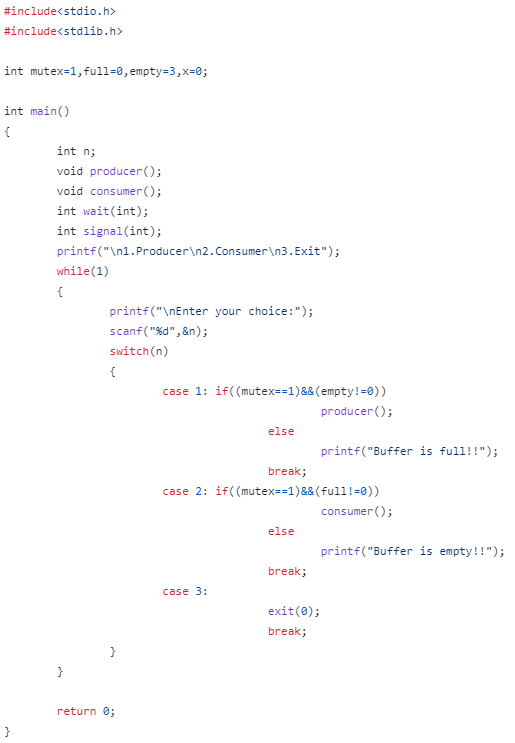
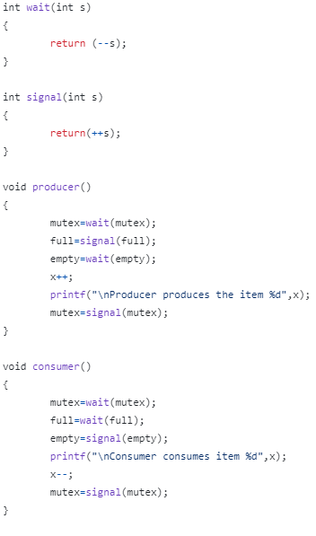
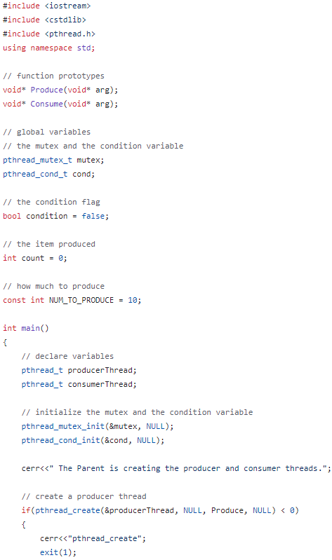
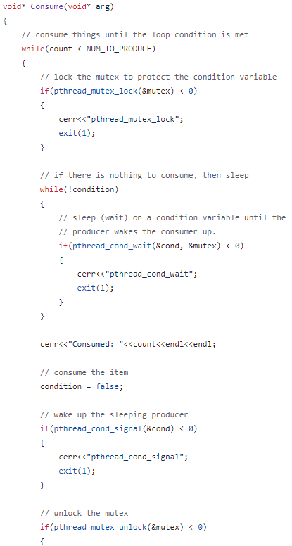
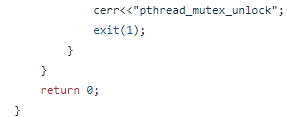
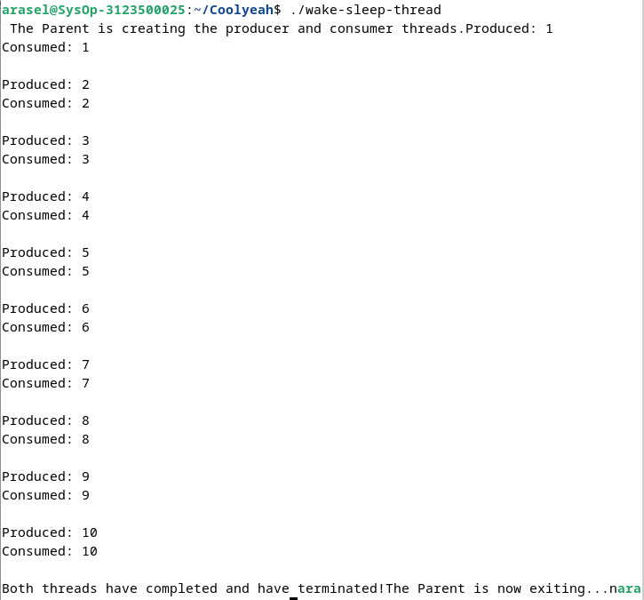

  <h1 style="text-align: center;font-weight: bold">LAPORAN PRAKTIKUM 10 SISTEM OPERASI</h1>
  <h4 style="text-align: center;">Dosen Pengampu : Dr. Ferry Astika Saputra, S.T., M.Sc.</h4>

 

  
  <h3 style="text-align: center;">Disusun Oleh : </h3>
  

    <strong>Achmad Risel Araby (3123500025)</strong> 
    <strong>Danur Isa Prabutama (3123500023)</strong> 
    <strong>Fikri Athanabil Efendi (3123500012)</strong>
  

<h3 style="text-align: center;line-height: 1.5">Politeknik Elektronika Negeri Surabaya Departemen Teknik Informatika Dan Komputer Program Studi Teknik Informatika 2023/2024</h3>
  

### DAFTAR ISI

## PRODUCER CONSUMER SEMAPHORE

Code :

Output :

Analisa :

Program diatas contoh implementasi dari Producer Consumer Semaphore problem dalam bahasa C. Dalam kasus ini, menu yang terdapat dalam program terdapat 3 menu, yaitu pertama Producer, kedua Consumer, dan ketiga Exit. Menu pertama Producer adalah untuk membuat data dengan maximal data sebanyak 3 jika user memilih secara terus menerus tanpa memilih selain menu pertama lebih dari 3 kali maka akan mencetak pesan "Buffer your full!!" begitu juga sebaliknya jika user memilih menu kedua dan lebih dari 3 kali tanpa memilih menu selain menu kedua maka akan mencetak pesan "Buffer is empty!!". Menu ketiga untuk keluar dari program.

## PRODUCER CONSUMER WAKE SLEEP THREAD

Code :

Output :

Analisa :

Program diatas contoh implementasi dari Producer Consumer Semaphore problem menggunakan thread dalam bahasa C++. Dalam kasus ini, program menggunakan thread untuk menjalankan produsen dan konsumen secara bersamaan. Dengan menggunakan mekanisme seperti kunci gembok (mutex) dan lampu lalu lintas (variabel kondisi), program memastikan bahwa hanya satu proses yang dapat mengakses sumber daya pada satu waktu. Saat produsen menghasilkan sesuatu, ia memberitahu konsumen bahwa ada barang baru yang tersedia. Begitu juga ketika konsumen mengonsumsi barang, ia memberi tahu produsen bahwa ia sudah mengambil barang tersebut. Dengan demikian, program memastikan bahwa proses produksi dan konsumsi berjalan dengan aman dan terkoordinasi.

### Referensi

https://www.geeksforgeeks.org/producer-consumer-problem-in-c/
